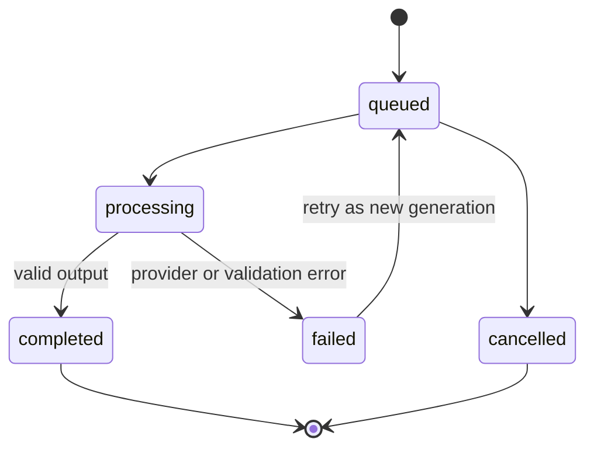
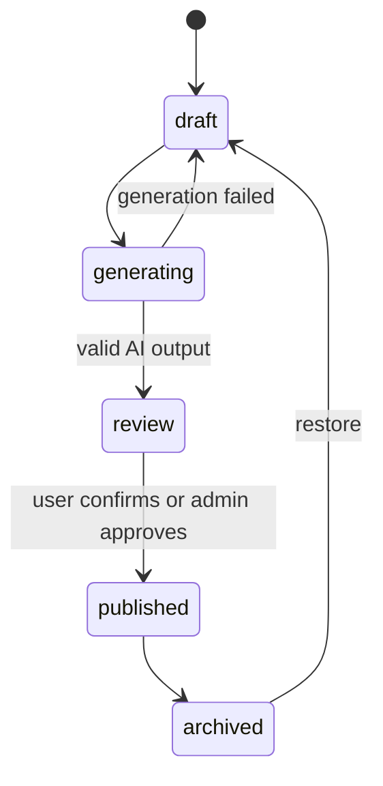
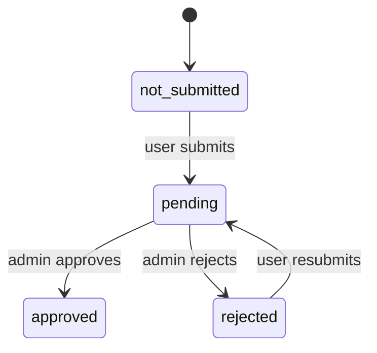
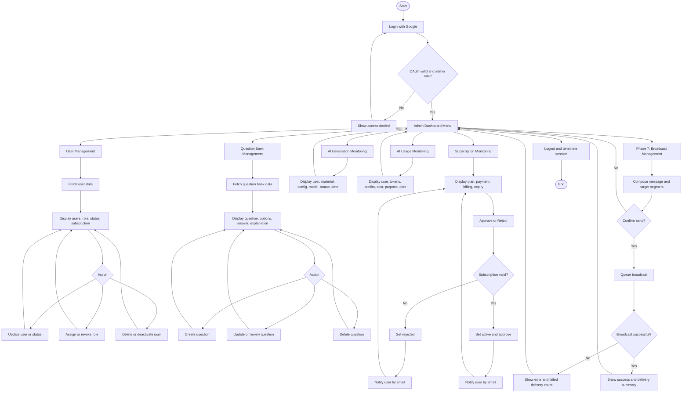

# System Flow

## Scope

Dokumen ini menerjemahkan rancangan flowchart user dan admin ke alur implementasi Laravel. Flow menggunakan keputusan arsitektur:

- Google OAuth only.
- Admin dan user menggunakan login yang sama serta dibedakan role.
- Blade + Livewire untuk UI.
- Google Gemini melalui queue untuk generation.
- Database canonical: `docs/database/AI_QUESTION_BANK.dbml`.

## User Flow

```mermaid
flowchart LR
    Start([Start]) --> Landing[Landing Page]
    Landing --> Login[Login with Google]
    Login --> OAuth{OAuth valid?}
    OAuth -- No --> LoginError[Show login error]
    LoginError --> Landing
    OAuth -- Yes --> Account{Account active?}
    Account -- No --> Blocked[Show account blocked]
    Account -- Yes --> Dashboard[User Dashboard]
    Dashboard --> Create[Create draft Question Set]
    Create --> MaterialChoice{Material source?}
    MaterialChoice -- Existing --> Existing[Select existing material]
    MaterialChoice -- Upload --> Upload[Upload material]
    MaterialChoice -- Text --> Text[Enter material text and mark ready]
    Upload --> ValidateMaterial{File valid?}
    ValidateMaterial -- No --> MaterialError[Show validation error]
    MaterialError --> Upload
    ValidateMaterial -- Yes --> Extract[Queue content extraction]
    Text --> Topic[Select chapter, topic, and focus]
    Existing --> Topic
    Extract --> Extraction{Extraction successful?}
    Extraction -- No --> ExtractionError[Show extraction error or retry]
    ExtractionError --> MaterialChoice
    Extraction -- Yes --> Ready[Mark material ready]
    Ready --> Topic
    Topic --> Config[Configure assessment, difficulty, type, and count]
    Config --> ValidConfig{Configuration valid?}
    ValidConfig -- No --> Config
    ValidConfig -- Yes --> Quota{Quota available?}
    Quota -- No --> Upgrade[Show quota and upgrade options]
    Upgrade --> Dashboard
    Quota -- Yes --> Reserve[Reserve generation credit]
    Reserve --> MarkGenerating[Link generation and mark generating]
    MarkGenerating --> Queue[Queue Gemini generation]
    Queue --> Generate{Generation successful and valid?}
    Generate -- No --> Release[Release credit and show retry]
    Release --> Config
    Generate -- Yes --> Charge[Charge credit]
    Charge --> Review[Review and edit draft questions]
    Review --> Save{Save review changes?}
    Save -- No --> Review
    Save -- Yes --> Persist[Save question set in review]
    Persist --> Publish{Publish now?}
    Publish -- No --> Dashboard
    Publish -- Yes --> Published[Set status published]
    Published --> Dashboard
    Dashboard --> Logout[Logout]
    Logout --> End([End])
```

### User Flow Rules

1. Login pertama membuat user dan role default; login berikutnya memperbarui profil Google.
2. Material upload harus lolos MIME, extension, size, dan ownership validation.
3. Material text menggunakan extraction status `not_required`; upload berjalan pending, processing, lalu completed/failed.
4. Material berubah dari draft menjadi ready setelah content text tersedia atau extraction berhasil.
5. Assessment type, difficulty, dan question type adalah konfigurasi berbeda.
6. Credit direservasi sebelum job dijalankan agar request paralel tidak melewati quota.
7. Credit hanya ditagihkan setelah output Gemini valid.
8. Raw response dan failure tetap disimpan untuk audit.
9. Question set berada pada status review sampai user mengonfirmasi publish.

## AI Generation State Flow

Setiap retry membuat record generation baru melalui `parent_generation_id`; history gagal tidak ditimpa. Draft question set yang sama diperbarui agar menunjuk generation baru dan kembali berstatus generating.

## Question Set State Flow

Admin review memiliki state terpisah:

Selama admin review pending/rejected, lifecycle utama tetap `question_sets.status = review`. Approval dapat mengubah lifecycle menjadi published.

## Admin Flow

### Admin Flow Rules

- Semua admin action menggunakan authorization policy, bukan hanya tampilan menu.
- User dibuat otomatis oleh Google OAuth; admin tidak membuat password account secara manual.
- Delete user sebaiknya berupa deactivation atau soft delete untuk menjaga audit.
- Subscription approval menyimpan admin, waktu approval, status, dan notifikasi email.
- Monitoring AI bersifat read-only kecuali retry/cancel diberikan secara eksplisit.
- Branch broadcast adalah target Phase 7 dan bukan release gate MVP.
- Broadcast membutuhkan confirmation, consent filter, opt-out filter, dan delivery log.
- Admin kembali ke dashboard atau list setelah setiap aksi selesai.

## Failure Handling

### OAuth Failure

Kembali ke landing dengan pesan generik. Detail provider dicatat di log server tanpa mengekspos token.

### Material Failure

File invalid ditolak sebelum disimpan. Extraction failure dapat di-retry tanpa membuat ulang metadata material.

### Quota Failure

Generation tidak dibuat jika quota tidak cukup. Reservation memiliki `reservation_expires_at`; scheduler melepaskan reservation yang gagal atau kedaluwarsa.

### Gemini Failure

Timeout, provider error, dan invalid JSON menghasilkan status failed, menyimpan audit, serta menawarkan retry.

### Broadcast Failure

Flow ini berlaku mulai Phase 7. Failure satu penerima tidak membatalkan seluruh campaign. Setiap penerima memiliki delivery status sendiri.