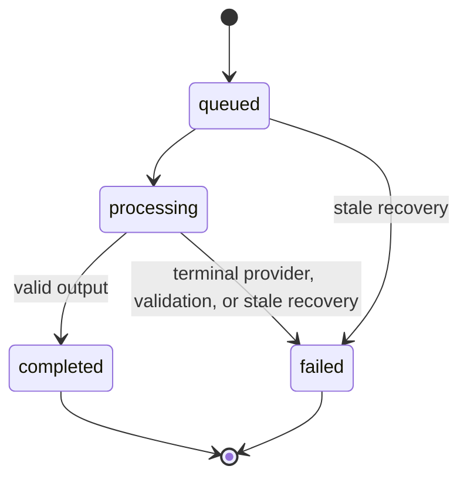
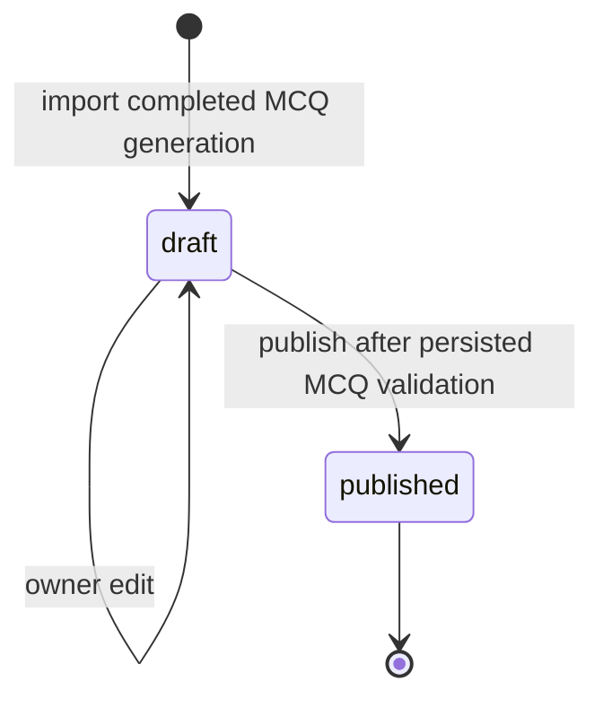
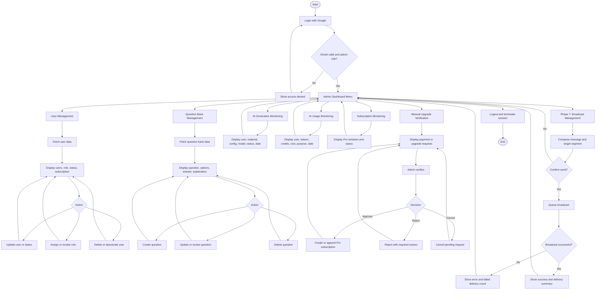

# System Flow

## Scope

Dokumen ini menerjemahkan rancangan flowchart user dan admin ke alur implementasi Laravel. Flow menggunakan keputusan arsitektur:

- Google OAuth only.
- Admin dan user menggunakan login yang sama serta dibedakan role.
- Blade + Vanilla JS untuk UI.
- Phase 2 Material Management menggunakan Blade/controller tanpa Livewire component.
- Phase 4.5 generation UI menggunakan Blade/controller dan vanilla JS polling, tanpa Livewire/React/Vue/websockets.
- Phase 5.7B3 Material Profile UI menggunakan Blade/controller dan vanilla JS polling bounded, tanpa Livewire/React/Vue/websockets.
- Phase 5.7C+D Blueprint dan Simple Generation Run UI, Phase 5.7E Advanced MCQ UI, dan Phase 5.7F True/False/Essay UI, menggunakan Blade/controller dan vanilla JS polling bounded, tanpa Livewire/React/Vue/websockets.
- Google Gemini melalui queue untuk generation, analisis profil materi, AI fill kisi-kisi, dan interpretasi import Blueprint (K2B.2).
- Database canonical: `docs/database/AI_QUESTION_BANK.dbml`.
- Phase 3.1 + 3.2: Plan catalog Free/Pro dan riwayat window Pro. Phase 3.3 + 3.4: resolver entitlement dan quota storage akun pada upload. Phase 3.5: definisi quota generation. Phase 3.6: Plan Offers, QRIS/WhatsApp, dan verifikasi admin.

## User Flow

### User Flow Rules

1. Login pertama membuat user dan role default; login berikutnya memperbarui profil Google. Entitlement default adalah Plan Free; OAuth tidak membuat baris subscription.
2. Phase 2 Material Management dibuka langsung dari dashboard dan tidak bergantung pada question set.
3. Material upload hanya menerima PDF, DOCX, atau TXT. Setiap file maksimal 10 MB. Quota storage akun Plan (Free 50 MiB / Pro 500 MiB total) adalah kontrol terpisah: `CreateUploadMaterial` mengunci baris user, menolak duplikat dulu, lalu menolak file baru jika usage terhitung + ukuran file melebihi limit Plan efektif. Materi baru hanya dibuat melalui unggah. `POST /materials/text` tidak ada. Field `source_type`/`content` pada unggah diabaikan; hasil tetap `source_type=upload`.
4. Material upload harus lolos MIME, extension, size, dan ownership validation.
5. Upload wajib menyimpan internal file path, file size, MIME type, SHA-256 hash, dan extraction status.
6. Kombinasi user dan file hash unique sehingga duplikat user yang sama ditolak.
7. Materi teks **lama** menggunakan extraction status `not_required` dan tetap dapat diedit. Pembuatan materi teks baru tidak tersedia. Upload berjalan pending, processing, lalu completed/failed. Penggantian file tidak didukung.
8. Material berubah dari draft menjadi ready setelah content text tersedia atau extraction berhasil.
9. Phase 5.7B1 Material Profile adalah fondasi internal: Queue/Claim/Heartbeat/Ready/Failure/Recovery. Scheduler `profiles:recover-stale` berjalan setiap menit `withoutOverlapping`.
9a. Phase 5.7B2 menambahkan eksekusi map/reduce sekuensial melalui boundary provider tersendiri (`MaterialProfileAnalysisProvider`; adapter Gemini hanya di `GeminiMaterialProfileProvider`). `StartMaterialProfileAnalysis` memakai kembali versi ready yang fingerprint-nya cocok, menolak versi queued/processing (`in_flight_exists`), dan membatasi tiga Profile Version baru per user per jam bergulir (`throttle_exceeded`). Dispatcher kanonis mengirim tepat satu Step berikutnya: map naik menurut `step_index`, reduce hanya setelah semua map ready dan menerima setiap extracted Element yang sudah tersimpan (tanpa truncasi diam-diam). Reduce memverifikasi fingerprint materi sebelum Attempt/HTTP. Satu `workflow_token` per versi, satu `step_execution_token` per Step, retry memakai token Step yang sama, maksimal tiga Attempt per Step, HTTP provider selalu di luar transaksi, dan reduce-ready plus Version-ready commit atomik. Job `failed()` yang leasenya kedaluwarsa tidak menulis apa pun. Worker produksi `database-generation --queue=question-generation,material-intelligence --timeout=270 --tries=3`. Analisis profil tidak memotong credit generation dan tidak menulis `ai_usage_logs`. v0.15.4: pengiriman same-token ditolak selama Attempt `started` masih hidup; persistensi map sukses mensyaratkan tepat satu Step berikutnya yang sah; Throwable tak terduga di batas provider menutup Attempt dengan kode tersanitasi. v0.15.5: kegagalan terminal Attempt dan workflow commit dalam satu transaksi; next Step sah hanya map immediate-next atau reduce setelah map terakhir.
9b. Phase 5.7B3 membuka workflow itu kepada owner materi: `GET /materials/{material}/profile` (review), `GET /materials/{material}/profile/status` (polling JSON bounded, tanpa side effect), `POST /materials/{material}/profile` (start/reuse), dan `POST /materials/{material}/profile/regenerate` (analisis ulang eksplisit). Semua rute memerlukan `auth`, `account.active`, `profile.complete`, dan otorisasi owner materi. State owner adalah `none`, `queued`, `processing`, `ready`, `failed`, atau `stale`, ditentukan dengan kontrak fingerprint yang sama seperti start sehingga hasil stale tidak pernah ditampilkan sebagai profil terkini. Regenerasi membuat versi baru dan tidak pernah mengubah versi terminal. Token, Attempt, payload provider, dan pesan exception mentah tidak pernah diekspos. v0.15.4: regenerasi yang gagal tetap `failed` di permukaan owner meskipun versi ready lama masih cocok fingerprint; versi lama dilabeli sebagai profil sebelumnya yang masih dapat dipakai.
9c. Phase 5.7C Question Blueprint: owner membuat draf kisi-kisi dari Profil ready yang fingerprint-nya cocok, memilih mapping konteks eksplisit, mengedit secara atomik, mengonfirmasi (idempotent; fingerprint disimpan), atau mengkloning confirmed menjadi satu draf. AI fill memakai `QuestionBlueprintAnalysisProvider`, antrian `material-intelligence`, throttle tiga **accepted queue events** per jam (retry draf yang sama mengonsumsi event baru), satu fill in-flight per Material, dan tetap `draft` (tidak auto-confirm, 0 credit). Offset provider relatif terhadap excerpt `context_ref` dan dikonversi server. Input AI dibatasi anggaran agregat dan fail-closed. Same-token plus Attempt `started` tidak memanggil provider kedua. `failed()` kedaluwarsa adalah no-op; `blueprints:recover-stale` menutup Attempt yang started. DOCX hanya confirmed (PhpWord 1.4.0, try/finally, `deleteFileAfterSend`). Missing/stale Profile pada AI fill HTTP mengarahkan ke `materials.profile.show`. First-N/full-book fallback dilarang. v0.15.8: opsi mapping hanya element extracted dengan offset dan chunk sumber yang valid; label cuplikan memakai pratinjau terbatas yang di-escape.
9d. Phase 5.7D Simple Generation Run: Start dari Blueprint confirmed yang masih current plus Profil ready. Mapping konteks bounded wajib; Start menolak sebelum reservasi jika mapping hilang. Lock baru: User → Material → Profile → Series → Blueprint → Run/Items/children → Usage. Same key + fingerprint mengunci User → Material → Run → items → children (`child_index`) → Usage → Attempts, mengembalikan Run asli, dan me-redispatch child queued pertama jika tidak ada child processing. Child sekuensial menurut `child_index`, satu processing, tanpa baris usage. Topologi 1:1 ketat. Fingerprint Material/Profil dicek ulang setelah HTTP. Sukses menagih sekali; gagal me-release sekali dan menutup Attempt started. Finalize legacy menolak child Run. `RecoverStaleGenerations` hanya `generation_run_id` null. `generation-runs:recover-stale` terpisah. Owner melihat soal completed read-only. Advanced/shuffle/Run QB import/question DOCX tidak ada. v0.15.8: anggaran child adalah span terrekonstruksi (termasuk `\n\n`), bukan 80.000 karakter Material utuh; persistensi pasca-HTTP mengunci User → Material → Run → items → children → usage → Attempts → Profile Version → spans → element/chunk dan menolak jika fingerprint/otoritas invalid; cutoff stale Run konsisten; kedua referensi span wajib; `DispatchQueuedRunChild` memulihkan next child queued setelah gagal dispatch pasca-commit; retry mempertahankan `idempotency_key`. v0.15.9: `BeginGenerationAttempt` menolak Attempt `started` yang sudah hidup; child masa depan `queued_at` null sampai eligible; redispatch tidak mereset jam queued; Finish tidak menulis ulang Attempt yang bukan `started`.
9e. Phase 5.7E Advanced MCQ: owner Pro aktif memilih mode lanjutan (1–5 baris MCQ, 1–10 per baris, total 1–30, mixed difficulty). Mode di-persist pada Blueprint; confirm/clone/AI retry/Run start/retry gagal memakai state persisted, bukan posted mode/shuffle. Free dan expired-Pro ditolak sebelum write untuk mutasi Advanced, tetapi dapat melihat Blueprint/Run existing, mengunduh DOCX confirmed, dan memakai Simple. Advanced AI fill memakai `blueprint-fill-v2` dan `ai_fill_requested_total` bersama token workflow baru; Simple tetap `blueprint-fill-v1`. Target workflow bukan total kanonis. Kualifikasi Start: 11–30 lolos karena skala; 1–10 membutuhkan mixed difficulty atau shuffle soal/opsi; penolakan sebelum Run/item/child/Usage/job/Attempt/HTTP; tidak ada konversi diam-diam ke Simple. Kredit tetap `ceil(n/10)` (1–10=1, 11–20=2, 21–30=3). Satu baris = satu item = satu child sekuensial; satu Usage per Run. Preview memakai presenter SHA-256 (`generation-run-shuffle-v1` + id Run + fingerprint) lintas child; opsi diurutkan dari kunci kanonis A–D ke kunci tampilan dan `correct_answer` di-remap lewat peta itu; `result_json` kanonis tidak berubah. Legacy generation default memakai `mcq-v3`, sedangkan Blueprint Run baru yang terkonfirmasi memakai `mcq-v4`.
9f. Phase 5.7F True/False dan Essay: Simple satu tipe (`multiple_choice` / `true_false` / `essay`) plus satu difficulty, total 1–10, tanpa shuffle. Advanced boleh campuran tipe dan difficulty, total 1–30; mixed type juga mengkualifikasi 1–10. Historical/null-composition fills memakai `blueprint-fill-v1` (Simple) atau `blueprint-fill-v2` (Advanced). `blueprint-fill-v3` tetap dipertahankan sebagai immutable historical typed contract / supported identity. Current typed fills memakai `blueprint-fill-v4` (Simple) dan `blueprint-fill-v5` (Advanced). Child Blueprint Run baru memakai strict versions: `mcq-v4`, `true-false-v2`, atau `essay-v2` sesuai `question_type` persisted; sementara legacy default generation tetap `mcq-v3`, `true-false-v1`, `essay-v1`. True/False menyimpan boolean JSON, tanpa opsi generated, preview selalu Benar lalu Salah. Essay menyimpan `model_answer` dan `rubric` teks. `shuffle_options` ditolak jika tidak ada baris MCQ. Kredit, child sekuensial, satu Usage, charge/release sekali, dan Pro gating 5.7E tidak berubah.
9g. Phase 5.7G Question Bank Import: owner mengimpor Run completed typed ke Question Set `draft` melalui `POST /generation-runs/{id}/question-sets` (idempotent, tanpa credit/provider). Owner mengedit typed draft MCQ/TF/Essay (atomik) lalu publish. DOCX siswa/guru memakai PhpWord (try/finally). Legacy `generation_id` import MCQ-only tetap. Run pembatalan, reorder, unpublish, dan delete out of scope.
9h. K2A DOCX Import Foundation: Pemasukan kisi-kisi dari dokumen DOCX. Pondasi ini murni backend: tidak memiliki UI publik, tidak memanggil Gemini, dan tidak menagih kredit. Duplikasi aktif ditolak di application level untuk status PENDING/PROCESSING/EXTRACTED pada `(user_id, material_id, file_hash)`; index pendukung biasa dan non-unique. Proses dieksekusi secara asinkron lewat `ExtractQuestionBlueprintImport` (queue: `material-extraction`), meretry kegagalan operasional, dan membersihkan source secara best-effort saat sukses atau gagal permanen. K2A menyimpan profil Material asal secara utuh untuk validasi keusangan (stale validation) di masa depan.
9i. K2B.1 Structured DOCX Persistence (Decision B, implemented): job ekstraksi yang sama membaca bytes DOCX tersimpan, menjalankan extractor struktural import-specific, lalu Material `DocxExtractor` (tidak diubah) untuk `extracted_text`. Hanya jika keduanya sukses, satu persistensi EXTRACTED menulis `extracted_text`, `structured_document`, dan `structure_schema_version=blueprint-import-structure-v1`, kemudian cleanup source. Kegagalan struktural atau teks gagal-tertutup sebelum EXTRACTED; tidak ada persistensi struktural parsial sebagai sukses. Baris EXTRACTED pra-K2B.1 boleh memiliki kolom struktur NULL (tanpa backfill; tanpa pelemahan duplikat). `structured_document` membedakan paragraf tubuh vs tabel, indeks 0-based, paragraf-dalam-sel, sel kosong, `gridSpan`, `vMerge`, dan `tblHeader`; bukan mesin layout Word, pagination, OCR, atau ekstraksi kanonis Material. Pada sukses EXTRACTED pasca-K2B.2, baris juga diinisialisasi ke interpretasi `queued` dan job `InterpretQuestionBlueprintImport` di-dispatch.
9j. K2B.2 AI Interpretation Foundation (implemented; git closure pending): job terpisah `InterpretQuestionBlueprintImport` (`database-generation` / `material-intelligence`, `timeout=270`, `tries=3`, `backoff=[5,15]`, `failOnTimeout=false`) membaca `structured_document` + `structure_schema_version` sebagai input otoritatif. `extracted_text` bukan input interpretasi. Tidak ada grounding Material/Profile. Prompt immutable `blueprint-import-interpret-v1`; isi DOCX adalah DATA tidak tepercaya di dalam delimiter struktur. Provider mengembalikan `document_kind` tertutup (`blueprint_like|matrix_incomplete|taxonomy_non_blueprint|ambiguous|empty`) plus kandidat source-ref-only. Server memvalidasi refs (paragraph vs cell dengan koordinat wajib), meresolusi raw values, menolak kandidat >100, menolak input serialisasi >262144 byte, dan memaksa canonical fields null. Status interpretasi terpisah: `queued → processing → review_ready|failed`. Zero credit / no `ai_usage_logs`. Review UI = K2B.3 (belum).
9j-i. Claim awal: `QUEUED → PROCESSING` hanya jika matching `import_id`, matching `interpretation_queued_at`, status `QUEUED`, dan `interpretation_claimed_at` NULL. Setelah claim sukses, `interpretation_claimed_at` adalah identitas lease processing.
9j-ii. Retry manual FAILED: `FAILED → QUEUED` membuat cycle token `interpretation_queued_at` yang lebih baru secara ketat (presisi detik). Jika `now <=` detik sebelumnya, token berikutnya = previous + 1 detik. Transisi memakai CAS terhadap import yang sama + status `FAILED` + `interpretation_queued_at` yang diamati sebelumnya. Model stale tidak boleh mengganti cycle retry yang lebih baru.
9j-iii. Retry transient provider/malformed: `PROCESSING → QUEUED` pada **siklus yang sama** (`interpretation_queued_at` tidak diganti), membersihkan `interpretation_claimed_at`, mempertahankan klasifikasi error yang aman bila berlaku, lalu melempar ulang exception agar queue meretry. Ini bukan cycle baru.
9j-iv. PROCESSING stale: PROCESSING non-stale tidak boleh memanggil provider kedua kali. PROCESSING stale boleh di-reclaim hanya setelah ambang 330 detik yang dikonfigurasi.
9j-v. Batas provider: HTTP Gemini dijalankan **di luar** transaksi DB claim/finalisasi. Transaksi database tidak tetap terbuka selama panggilan Gemini.
9j-vi. Persistensi otoritatif akhir (sukses/gagal) mensyaratkan matching `import_id`, `interpretation_status=PROCESSING`, `interpretation_queued_at` yang sama, dan `interpretation_claimed_at` yang sama. Persistensi worker stale/usang adalah no-op.
9j-vii. `REVIEW_READY` terminal untuk K2B.2. Delivery duplikat/stale tidak boleh menimpa hasil valid. Kebenaran antrian: at-least-once delivery + CAS cycle/lease + stale checks + `WithoutOverlapping` `blueprint-import-interpretation:{importId}` (`releaseAfter=60`, `expireAfter=330`); **tidak** memakai `ShouldBeUnique`. Exactly-once HTTP Gemini tidak dijamin (crash setelah provider sukses sebelum persist boleh reclaim dan memanggil ulang); satu hasil persist otoritatif dijamin. Duplikat delivery boleh; duplikat hasil persist otoritatif tidak.
10. Seluruh upload yang belum dihapus tetap dihitung pada storage usage, termasuk archived dan extraction failed.
11. Owner dapat melakukan `draft|ready -> archived` dan `archived -> ready`.
12. Assessment type, difficulty, dan question type adalah konfigurasi berbeda.
13. Credit direservasi pada Start. Legacy Start: satu Generation = satu reservation `credits=1`. Generation Run: satu reservation pada Run dengan `credits = ceil(n/10)` (1–10 = 1, 11–20 = 2, 21–30 = 3). Child Run tidak punya baris usage. Generation tidak memerlukan draft `question_sets`.
14. Credit hanya ditagihkan (`charged`) setelah output valid. Occupancy = `SUM(credits)` reserved+charged. Terminal failure me-release reservation. Blueprint AI tidak menulis usage.
15. Automatic provider/job retry memakai Generation dan reservation yang sama (`attempt_number` counts started HTTP calls, 0 at queue, max 3). Manual retry setelah terminal `failed` membuat Generation baru dan reservation baru; `parent_generation_id` ditulis dalam transaksi Start. `execution_token` membedakan resume Job yang sama vs Job kompetitor.
16. Jangan persist raw prompt atau full raw Gemini/provider response secara default. Error/diagnostik disanitasi. Preview completed `result_json` adalah Phase 4.5 (read-only). Question Bank mengimpor generation completed MCQ atau Run completed typed ke Question Set `draft`, mengizinkan edit draf typed, publish ke `published`, dan export DOCX published tanpa mengubah data generasi/Run runtime.
17. Stale queued (`queued_at`) atau processing (`updated_at`) + reserved di-recover ke `failed` + `released` (`stale_recovery`) tanpa HTTP provider. User cancel ditunda.

## AI Generation State Flow

Current Phase 4 runtime never writes `cancelled`. User-initiated `queued|processing → cancelled` is deferred and is not current behavior. The enum value remains for a future Cancel feature.

Automatic provider/job retry stays on the **same** `AiGeneration` and the **same** `AiUsageLog` reservation. `attempt_number` is the count of provider HTTP calls started (0 while queued). No extra credit. Same Job `execution_token` may resume `processing`; a different token must not call the provider. Do not create a child Generation for automatic retry.

Phase 4.3+4.4 persist validated MCQ `result_json` (partial after each attempt) and per-call `ai_generation_attempts` (including the prompt version actually used). Phase 4.5 renders completed `result_json` only; queued/processing/failed HTML must not leak partial results, tokens, or provider internals. Status JSON is `{ generation_status, terminal }` only. Question Bank import is explicit and writes `draft`; Phase 5 edit/publish do not mutate generation runtime.

Manual user retry after terminal `failed`: the old Generation remains `failed`; its reservation is `released`; `RetryFailedQuestionGeneration` starts a **new** Generation with a new reservation and `parent_generation_id` in the same Start transaction. When `parentGenerationId` is set, Start validates inside the same transaction (after the User lock, before insert) that the parent exists, belongs to the same User, is `failed`, has stored Usage, and that Usage is `released`. Foreign, non-failed, failed+reserved, failed+charged, and missing-usage parents are rejected.

Phase 4.5 polling: vanilla JS captures the initial `generation_status` and reloads the page on any observed status change (including queued → processing) as well as terminal status. Status JSON remains `{ generation_status, terminal }` only.

Stale recovery (`RecoverStaleGenerations`, scheduled every minute `withoutOverlapping(10)` from `routes/console.php`) scans **legacy** candidate IDs (`generation_run_id` null) without locks, then per ID locks User → Generation → Usage, re-checks timestamps, and terminalizes stale reserved orphans. Queued clock is `queued_at`; processing clock is `updated_at`. Runtime TTL is `max(1800, configured stale_after_seconds)`: 1800 is the minimum safe floor; operators may configure a higher threshold. Leave `execution_token` on processing rows. Do not touch STARTED attempt rows. Run recovery is `RecoverStaleGenerationRuns` / `generation-runs:recover-stale`. Blueprint fill recovery is `blueprints:recover-stale`.

Phase 5.1–5.6 (`COMPLETE`): owner may import a completed MCQ Generation into a **draft** Question Set, edit that draft, and publish it. Phase 5.7G adds Run import into typed draft sets, typed draft edit/publish (MCQ/TF/Essay), and published student/teacher DOCX. Persistence is an explicit import snapshot. Generation/Run `result_json` remains audit/preview data. One Generation or one Run produces at most one Question Set. Edit, publish, import, and DOCX do not charge quota or call Gemini.

## Question Set State Flow

Question Bank / `question_sets` is Phase 5. It is not a prerequisite of Phase 4 generation.

Current Phase 5 runtime: import and edit write `draft`; explicit publish writes `published`. Locked product lifecycle is `draft → published`. `generating`, `review`, and `archived` are not active paths.

Canonical schema may still store `generating`, `review`, and `archived`. Phase 5 does not transition into those values.

Admin review (`review_status`) remains a future/Phase 6 concern. Import and publish leave `not_submitted`. Visibility stays `private`.

## Admin Flow

### Admin Flow Rules

- Semua admin action menggunakan authorization policy, bukan hanya tampilan menu.
- User dibuat otomatis oleh Google OAuth; admin tidak membuat password account secara manual.
- Monitoring subscription terpisah dari verifikasi pembayaran/upgrade manual (minimum Phase 3.6; dashboard penuh Phase 6). Domain 3.1 + 3.2 hanya catalog Plan dan riwayat window Pro.
- Delete user sebaiknya berupa deactivation atau soft delete untuk menjaga audit.
- Verifikasi permintaan pembayaran/upgrade menyimpan admin, waktu keputusan, dan alasan penolakan pada `subscription_upgrade_requests`, bukan pada Subscription. Admin dapat approve, reject (alasan wajib), atau cancel. User tidak dapat membatalkan pending miliknya. Notifikasi email belum termasuk Phase 3.6.
- Verifikasi pembayaran tidak menembus `MaterialPolicy`. Admin tidak memperoleh akses global ke Material privat.
- Monitoring AI bersifat read-only kecuali retry/cancel diberikan secara eksplisit.
- Branch broadcast adalah target Phase 7 dan bukan release gate MVP.
- Broadcast membutuhkan confirmation, consent filter, opt-out filter, dan delivery log.
- Admin kembali ke dashboard atau list setelah setiap aksi selesai.

## Failure Handling

### OAuth Failure

Kembali ke landing dengan pesan generik. Detail provider dicatat di log server tanpa mengekspos token.

### Material Failure

File invalid ditolak sebelum disimpan. Extraction failure dapat di-retry tanpa membuat ulang metadata material.

### Quota Failure

Upload yang melebihi `storage_limit_bytes` ditolak. Allowance generation didefinisikan di Phase 3.5 dan ditegakkan di Phase 4.1+4.2 (`available = allowance - charged - reserved`). Terminal generation failure me-release credit via `FinalizeGenerationFailure`.

### Gemini Failure

Timeout, provider error, dan invalid JSON: automatic retry on the same Generation/reservation until the 3-HTTP budget is exhausted; then `failed`, sanitized error metadata, and Release. Job worker timeout is retryable (`failOnTimeout` false) and resumes with the same `execution_token`. Manual retry is a new Generation. Stale queued/processing reservations recover to `failed` + `released` without HTTP. Do not persist full raw provider responses. Oversize/empty Material and missing `output_language` fail closed with no HTTP.

### Broadcast Failure

Flow ini berlaku mulai Phase 7. Failure satu penerima tidak membatalkan seluruh campaign. Setiap penerima memiliki delivery status sendiri.