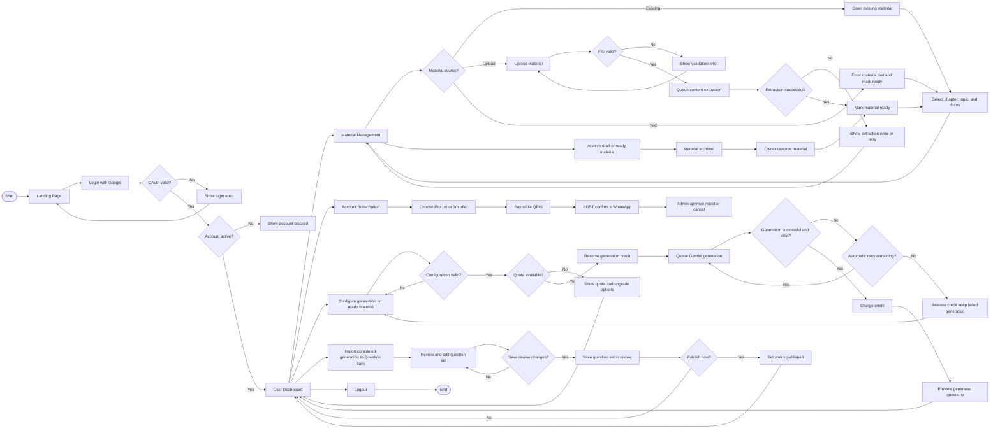
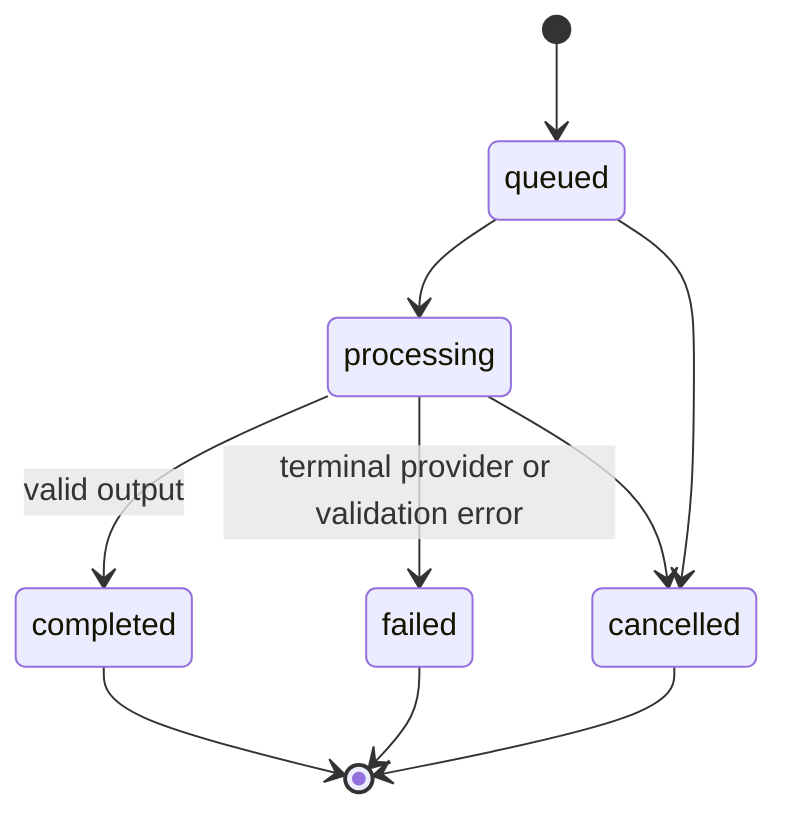
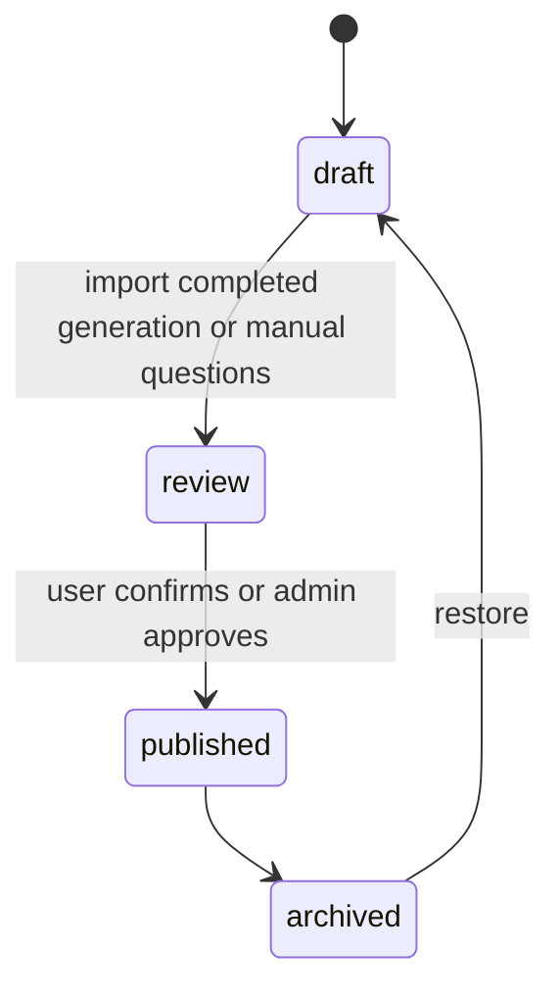
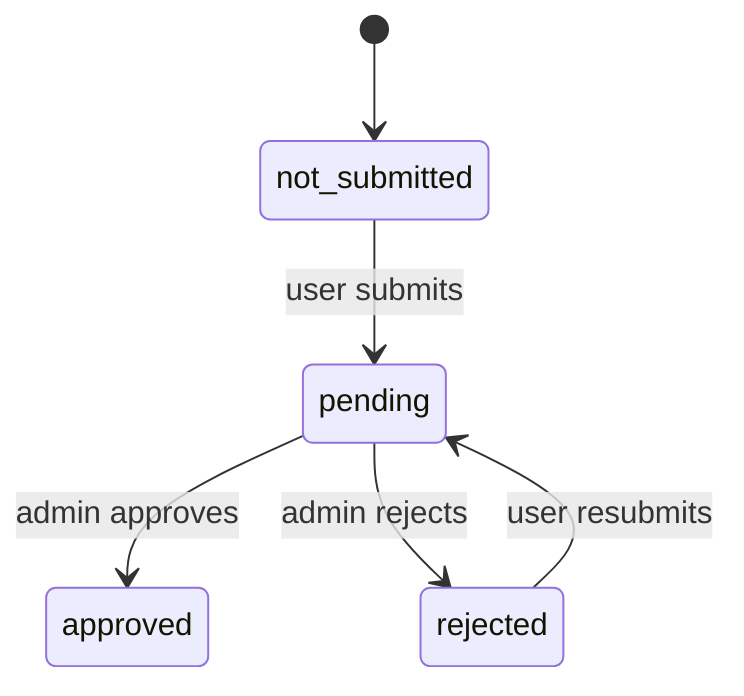

# System Flow

## Scope

Dokumen ini menerjemahkan rancangan flowchart user dan admin ke alur implementasi Laravel. Flow menggunakan keputusan arsitektur:

- Google OAuth only.
- Admin dan user menggunakan login yang sama serta dibedakan role.
- Blade + Livewire untuk UI.
- Phase 2 Material Management menggunakan Blade/controller tanpa Livewire component.
- Google Gemini melalui queue untuk generation.
- Database canonical: `docs/database/AI_QUESTION_BANK.dbml`.
- Phase 3.1 + 3.2: Plan catalog Free/Pro dan riwayat window Pro. Phase 3.3 + 3.4: resolver entitlement dan quota storage akun pada upload. Phase 3.5: definisi quota generation. Phase 3.6: Plan Offers, QRIS/WhatsApp, dan verifikasi admin.

## User Flow

### User Flow Rules

1. Login pertama membuat user dan role default; login berikutnya memperbarui profil Google. Entitlement default adalah Plan Free; OAuth tidak membuat baris subscription.
2. Phase 2 Material Management dibuka langsung dari dashboard dan tidak bergantung pada question set.
3. Material upload hanya menerima PDF, DOCX, atau TXT. Setiap file maksimal 10 MB. Quota storage akun Plan (Free 50 MiB / Pro 500 MiB total) adalah kontrol terpisah: `CreateUploadMaterial` mengunci baris user, menolak duplikat dulu, lalu menolak file baru jika usage terhitung + ukuran file melebihi limit Plan efektif.
4. Material upload harus lolos MIME, extension, size, dan ownership validation.
5. Upload wajib menyimpan internal file path, file size, MIME type, SHA-256 hash, dan extraction status.
6. Kombinasi user dan file hash unique sehingga duplikat user yang sama ditolak.
7. Material text menggunakan extraction status `not_required`; upload berjalan pending, processing, lalu completed/failed.
8. Material berubah dari draft menjadi ready setelah content text tersedia atau extraction berhasil.
9. Seluruh upload yang belum dihapus tetap dihitung pada storage usage, termasuk archived dan extraction failed.
10. Owner dapat melakukan `draft|ready -> archived` dan `archived -> ready`.
11. Assessment type, difficulty, dan question type adalah konfigurasi berbeda.
12. Credit direservasi pada Start generation (satu request = satu reservation) agar request paralel tidak melewati quota. Generation tidak memerlukan draft `question_sets`.
13. Credit hanya ditagihkan (`charged`) setelah output valid. Terminal failure me-release reservation.
14. Automatic provider/job retry memakai Generation dan reservation yang sama (`attempt_number` boleh naik; tanpa credit tambahan). Manual retry setelah terminal failure membuat Generation baru dan reservation baru; `parent_generation_id` boleh menunjuk Generation lama.
15. Jangan persist raw prompt atau full raw Gemini/provider response secara default. Error/diagnostik disanitasi. Preview generation adalah Phase 4; Question Bank / `question_sets` adalah Phase 5 dan boleh mengimpor hasil generation yang completed.

## AI Generation State Flow

Automatic provider/job retry stays on the **same** `AiGeneration` and the **same** `AiUsageLog` reservation. `attempt_number` may increase. No extra credit. Do not create a child Generation for automatic retry.

Manual user retry after terminal failure: the old Generation remains `failed`; its reservation is `released`; the user starts a **new** Generation with a new reservation; `parent_generation_id` may link to the old Generation.

Phase 4 does not create or require `question_sets`. It stores generation runtime (and later a preview). Question Bank is Phase 5 and may import an approved completed generation.

## Question Set State Flow

Question Bank / `question_sets` is Phase 5. It is not a prerequisite of Phase 4 generation.

Admin review memiliki state terpisah:

Selama admin review pending/rejected, lifecycle utama tetap `question_sets.status = review`. Approval dapat mengubah lifecycle menjadi published.

## Admin Flow

### Admin Flow Rules

- Semua admin action menggunakan authorization policy, bukan hanya tampilan menu.
- User dibuat otomatis oleh Google OAuth; admin tidak membuat password account secara manual.
- Monitoring subscription terpisah dari verifikasi pembayaran/upgrade manual (minimum Phase 3.6; dashboard penuh Phase 6). Domain 3.1 + 3.2 hanya catalog Plan dan riwayat window Pro.
- Delete user sebaiknya berupa deactivation atau soft delete untuk menjaga audit.
- Verifikasi permintaan pembayaran/upgrade menyimpan admin, waktu keputusan, dan alasan penolakan pada `subscription_upgrade_requests`, bukan pada Subscription. Admin dapat approve, reject (alasan wajib), atau cancel. User tidak dapat membatalkan pending miliknya. Notifikasi email belum termasuk Phase 3.6.
- Verifikasi pembayaran tidak menembus `MaterialPolicy`. Admin tidak memperoleh akses global ke Material privat.
- Monitoring AI bersifat read-only kecuali retry/cancel diberikan secara eksplisit.
- Branch broadcast adalah target Phase 7 dan bukan release gate MVP.
- Broadcast membutuhkan confirmation, consent filter, opt-out filter, dan delivery log.
- Admin kembali ke dashboard atau list setelah setiap aksi selesai.

## Failure Handling

### OAuth Failure

Kembali ke landing dengan pesan generik. Detail provider dicatat di log server tanpa mengekspos token.

### Material Failure

File invalid ditolak sebelum disimpan. Extraction failure dapat di-retry tanpa membuat ulang metadata material.

### Quota Failure

Upload yang melebihi `storage_limit_bytes` ditolak. Allowance generation didefinisikan di Phase 3.5 dan ditegakkan di Phase 4.1+4.2 (`available = allowance - charged - reserved`). Generation gagal me-release credit (Action exists; Gemini job is Phase 4.3+).

### Gemini Failure

Timeout, provider error, dan invalid JSON: automatic retry on the same Generation/reservation until the budget is exhausted; then `failed`, sanitized error metadata, and Release. Manual retry is a new Generation. Do not persist full raw provider responses by default.

### Broadcast Failure

Flow ini berlaku mulai Phase 7. Failure satu penerima tidak membatalkan seluruh campaign. Setiap penerima memiliki delivery status sendiri.