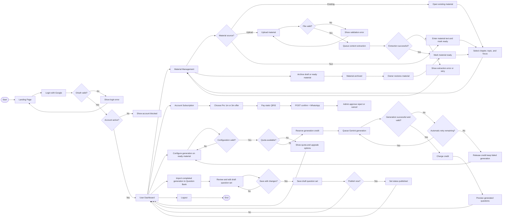
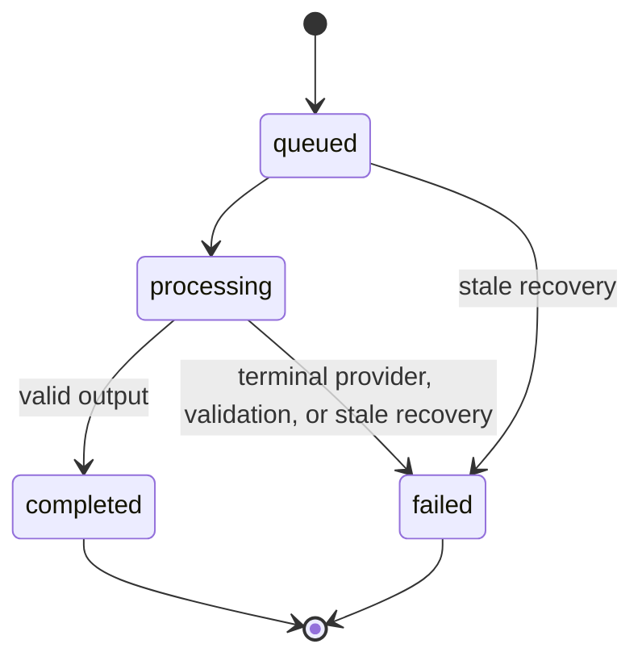
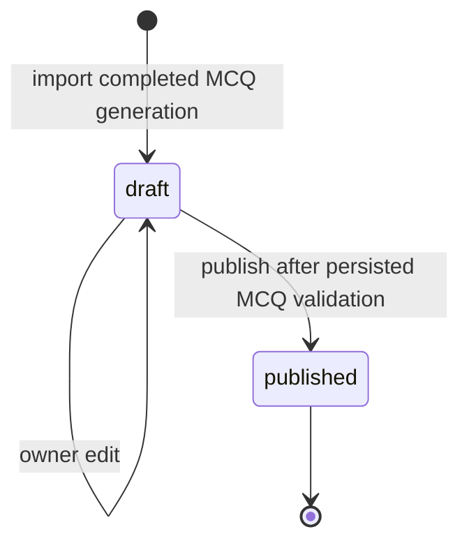

# System Flow

## Scope

Dokumen ini menerjemahkan rancangan flowchart user dan admin ke alur implementasi Laravel. Flow menggunakan keputusan arsitektur:

- Google OAuth only.
- Admin dan user menggunakan login yang sama serta dibedakan role.
- Blade + Livewire untuk UI.
- Phase 2 Material Management menggunakan Blade/controller tanpa Livewire component.
- Phase 4.5 generation UI menggunakan Blade/controller dan vanilla JS polling, tanpa Livewire/React/Vue/websockets.
- Google Gemini melalui queue untuk generation.
- Database canonical: `docs/database/AI_QUESTION_BANK.dbml`.
- Phase 3.1 + 3.2: Plan catalog Free/Pro dan riwayat window Pro. Phase 3.3 + 3.4: resolver entitlement dan quota storage akun pada upload. Phase 3.5: definisi quota generation. Phase 3.6: Plan Offers, QRIS/WhatsApp, dan verifikasi admin.

## User Flow

### User Flow Rules

1. Login pertama membuat user dan role default; login berikutnya memperbarui profil Google. Entitlement default adalah Plan Free; OAuth tidak membuat baris subscription.
2. Phase 2 Material Management dibuka langsung dari dashboard dan tidak bergantung pada question set.
3. Material upload hanya menerima PDF, DOCX, atau TXT. Setiap file maksimal 10 MB. Quota storage akun Plan (Free 50 MiB / Pro 500 MiB total) adalah kontrol terpisah: `CreateUploadMaterial` mengunci baris user, menolak duplikat dulu, lalu menolak file baru jika usage terhitung + ukuran file melebihi limit Plan efektif.
4. Material upload harus lolos MIME, extension, size, dan ownership validation.
5. Upload wajib menyimpan internal file path, file size, MIME type, SHA-256 hash, dan extraction status.
6. Kombinasi user dan file hash unique sehingga duplikat user yang sama ditolak.
7. Material text menggunakan extraction status `not_required`; upload berjalan pending, processing, lalu completed/failed.
8. Material berubah dari draft menjadi ready setelah content text tersedia atau extraction berhasil.
9. Seluruh upload yang belum dihapus tetap dihitung pada storage usage, termasuk archived dan extraction failed.
10. Owner dapat melakukan `draft|ready -> archived` dan `archived -> ready`.
11. Assessment type, difficulty, dan question type adalah konfigurasi berbeda.
12. Credit direservasi pada Start generation (satu request = satu reservation) agar request paralel tidak melewati quota. Generation tidak memerlukan draft `question_sets`.
13. Credit hanya ditagihkan (`charged`) setelah output valid. Terminal failure me-release reservation.
14. Automatic provider/job retry memakai Generation dan reservation yang sama (`attempt_number` counts started HTTP calls, 0 at queue, max 3). Manual retry setelah terminal `failed` membuat Generation baru dan reservation baru; `parent_generation_id` ditulis dalam transaksi Start. `execution_token` membedakan resume Job yang sama vs Job kompetitor.
15. Jangan persist raw prompt atau full raw Gemini/provider response secara default. Error/diagnostik disanitasi. Preview completed `result_json` adalah Phase 4.5 (read-only). Question Bank mengimpor generation completed MCQ ke Question Set `draft`, mengizinkan edit draf, dan publish ke `published` tanpa mengubah data generasi.
16. Stale queued (`queued_at`) atau processing (`updated_at`) + reserved di-recover ke `failed` + `released` (`stale_recovery`) tanpa HTTP provider. User cancel ditunda.

## AI Generation State Flow

Current Phase 4 runtime never writes `cancelled`. User-initiated `queued|processing → cancelled` is deferred and is not current behavior. The enum value remains for a future Cancel feature.

Automatic provider/job retry stays on the **same** `AiGeneration` and the **same** `AiUsageLog` reservation. `attempt_number` is the count of provider HTTP calls started (0 while queued). No extra credit. Same Job `execution_token` may resume `processing`; a different token must not call the provider. Do not create a child Generation for automatic retry.

Phase 4.3+4.4 persist validated MCQ `result_json` (partial after each attempt) and per-call `ai_generation_attempts` (including the prompt version actually used). Phase 4.5 renders completed `result_json` only; queued/processing/failed HTML must not leak partial results, tokens, or provider internals. Status JSON is `{ generation_status, terminal }` only. Question Bank import is explicit and writes `draft`; Batch 2 edit/publish do not mutate generation runtime.

Manual user retry after terminal `failed`: the old Generation remains `failed`; its reservation is `released`; `RetryFailedQuestionGeneration` starts a **new** Generation with a new reservation and `parent_generation_id` in the same Start transaction. When `parentGenerationId` is set, Start validates inside the same transaction (after the User lock, before insert) that the parent exists, belongs to the same User, is `failed`, has stored Usage, and that Usage is `released`. Foreign, non-failed, failed+reserved, failed+charged, and missing-usage parents are rejected.

Phase 4.5 polling: vanilla JS captures the initial `generation_status` and reloads the page on any observed status change (including queued → processing) as well as terminal status. Status JSON remains `{ generation_status, terminal }` only.

Stale recovery (`RecoverStaleGenerations`, scheduled every minute `withoutOverlapping(10)` from `routes/console.php`) scans candidate IDs without locks, then per ID locks User → Generation → Usage, re-checks timestamps, and terminalizes stale reserved orphans. Queued clock is `queued_at`; processing clock is `updated_at`. Runtime TTL is `max(1800, configured stale_after_seconds)`: 1800 is the minimum safe floor; operators may configure a higher threshold. Leave `execution_token` on processing rows. Do not touch STARTED attempt rows.

Phase 5.1–5.6: owner may import a completed MCQ Generation into a **draft** Question Set, edit that draft, and publish it. Persistence is an explicit import snapshot. Generation `result_json` remains audit/preview data. One Generation produces at most one Question Set. Edit and publish do not charge quota or call Gemini.

## Question Set State Flow

Question Bank / `question_sets` is Phase 5. It is not a prerequisite of Phase 4 generation.

Current Batch 2 runtime: import and edit write `draft`; explicit publish writes `published`. Locked product lifecycle is `draft → published`. `generating`, `review`, and `archived` are not active paths.

Canonical schema may still store `generating`, `review`, and `archived`. Batch 2 must not transition into those values.

Admin review (`review_status`) remains a future/Phase 6 concern. Import and publish leave `not_submitted`. Visibility stays `private`.

## Admin Flow

### Admin Flow Rules

- Semua admin action menggunakan authorization policy, bukan hanya tampilan menu.
- User dibuat otomatis oleh Google OAuth; admin tidak membuat password account secara manual.
- Monitoring subscription terpisah dari verifikasi pembayaran/upgrade manual (minimum Phase 3.6; dashboard penuh Phase 6). Domain 3.1 + 3.2 hanya catalog Plan dan riwayat window Pro.
- Delete user sebaiknya berupa deactivation atau soft delete untuk menjaga audit.
- Verifikasi permintaan pembayaran/upgrade menyimpan admin, waktu keputusan, dan alasan penolakan pada `subscription_upgrade_requests`, bukan pada Subscription. Admin dapat approve, reject (alasan wajib), atau cancel. User tidak dapat membatalkan pending miliknya. Notifikasi email belum termasuk Phase 3.6.
- Verifikasi pembayaran tidak menembus `MaterialPolicy`. Admin tidak memperoleh akses global ke Material privat.
- Monitoring AI bersifat read-only kecuali retry/cancel diberikan secara eksplisit.
- Branch broadcast adalah target Phase 7 dan bukan release gate MVP.
- Broadcast membutuhkan confirmation, consent filter, opt-out filter, dan delivery log.
- Admin kembali ke dashboard atau list setelah setiap aksi selesai.

## Failure Handling

### OAuth Failure

Kembali ke landing dengan pesan generik. Detail provider dicatat di log server tanpa mengekspos token.

### Material Failure

File invalid ditolak sebelum disimpan. Extraction failure dapat di-retry tanpa membuat ulang metadata material.

### Quota Failure

Upload yang melebihi `storage_limit_bytes` ditolak. Allowance generation didefinisikan di Phase 3.5 dan ditegakkan di Phase 4.1+4.2 (`available = allowance - charged - reserved`). Terminal generation failure me-release credit via `FinalizeGenerationFailure`.

### Gemini Failure

Timeout, provider error, dan invalid JSON: automatic retry on the same Generation/reservation until the 3-HTTP budget is exhausted; then `failed`, sanitized error metadata, and Release. Job worker timeout is retryable (`failOnTimeout` false) and resumes with the same `execution_token`. Manual retry is a new Generation. Stale queued/processing reservations recover to `failed` + `released` without HTTP. Do not persist full raw provider responses. Oversize/empty Material and missing `output_language` fail closed with no HTTP.

### Broadcast Failure

Flow ini berlaku mulai Phase 7. Failure satu penerima tidak membatalkan seluruh campaign. Setiap penerima memiliki delivery status sendiri.