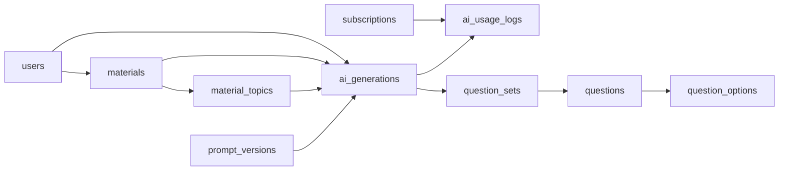
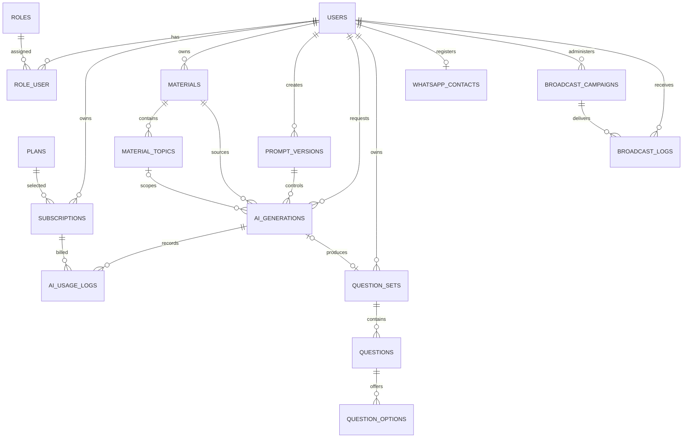

# Database Reference

## Source of Truth

Schema domain canonical tersedia dalam format DBML:

`docs/database/AI_QUESTION_BANK.dbml`

DBML tersebut dapat dibuka di dbdiagram.io atau dikompilasi menjadi SQL. Dokumen ini menjelaskan aturan bisnis yang tidak dapat dijamin hanya oleh diagram.

- Version: 0.4
- Domain entities: 16
- Target implementation: Laravel 13 / MySQL 8+
- Primary key style: Laravel `id` untuk entitas Phase 1; entitas future mengikuti DBML sampai phase implementasinya
- Timestamp style: `created_at`, `updated_at`, dan `deleted_at` jika diperlukan

Tabel bawaan Laravel seperti sessions, cache, jobs, job batches, dan failed jobs tidak dihitung sebagai domain entity.

## Core Pipeline

## Entity Catalog

### User Management

#### `users`

Menyimpan identitas Google, profil, consent, status, dan aktivitas login.

Key constraints:

- `google_id` dan `email` wajib serta unique.
- Tidak ada password lokal.
- Status: active, suspended, inactive.
- Migration OAuth Phase 1 hanya berjalan otomatis ketika tabel legacy users dan password reset masih kosong.
- Rollback migration OAuth ditolak ketika user OAuth sudah ada agar identitas login tidak terhapus.

#### `roles`

Daftar role aplikasi. Seed Phase 1: `USER` dan `ADMIN`. `role_name` wajib unique.

#### `role_user`

Pivot many-to-many user-role dengan composite primary key `(user_id, role_id)`.

### Subscription

#### `plans`

Menentukan harga, currency, billing period, generation credit, storage limit dalam MB, dan status active/inactive/archived.

Billing period: monthly, yearly, lifetime.

#### `subscriptions`

Riwayat kepemilikan plan user, periode aktif, payment status, dan approval admin.

Aturan aplikasi:

- Maksimal satu subscription aktif per user.
- Free subscription baru dibuat saat Phase 3 diimplementasikan.
- Aktivasi dan penolakan mencatat admin serta waktu keputusan.

### Material Management

#### `materials`

Materi milik user yang berasal dari upload atau input teks.

Aturan aplikasi:

- Source upload mewajibkan file path, file size, dan MIME type.
- Source text mewajibkan content.
- Source text memakai extraction status `not_required` dan dapat langsung berubah dari draft menjadi ready.
- Source upload berjalan pending, processing, completed/failed; status material menjadi ready setelah extraction completed.
- File aktif dihitung terhadap `plans.storage_limit_mb`.
- File hash digunakan untuk mendeteksi duplikasi.

#### `material_topics`

Bab, sub-bab, topik, focus area, dan rentang halaman yang berasal dari satu material.

Kombinasi material, chapter, sub-chapter, dan topic dibuat unique.

### AI Engine

#### `prompt_versions`

Snapshot aturan prompt dan output schema. Version number wajib unique dan hanya satu version boleh active.

Satu active prompt version berisi schema diskriminatif untuk ketiga question type.

Komponen:

- base prompt
- material rule
- assessment rule
- difficulty rule
- question rule
- answer rule
- explanation rule
- quality rule
- JSON output schema

#### `ai_generations`

Audit satu percobaan generation:

- actor dan source material
- topic dan prompt version
- assessment, difficulty, question type, dan count
- provider serta model Gemini
- token dan estimated cost
- raw response dan parsed output
- queue timestamps, status, serta error
- parent generation untuk retry lineage

Status: queued, processing, completed, failed, cancelled.

Retry hanya dibuat untuk generation gagal. Draft question set yang sama memperbarui `generation_id` ke generation anak sebelum job diantrekan; history tetap tersedia melalui `parent_generation_id`. Satu question set hanya menunjuk generation aktif/terakhir.

#### `ai_usage_logs`

Ledger credit dan usage per subscription. Tabel ini menjadi sumber quota check, bukan counter yang dapat ditimpa.

Lifecycle:

1. Buat log `reserved` sebelum job dikirim.
2. Ubah menjadi `charged` ketika output valid.
3. Ubah menjadi `released` ketika generation gagal, dibatalkan, atau melewati `reservation_expires_at`.

Quota periode dihitung dari total `credit_used` berstatus charged di antara start dan end subscription.

Action ledger hanya `generate` atau `retry`. Validasi output merupakan bagian dari generation dan tidak mengurangi credit terpisah.

### Question Bank

#### `question_sets`

Container question milik user. Question set dibuat sebagai draft sebelum generation, menjadi generating saat job diantrekan, lalu review setelah generated questions valid. Set manual tetap boleh memiliki `generation_id` null.

Lifecycle utama: draft, generating, review, published, archived.

Admin review menggunakan `review_status`: not_submitted, pending, approved, rejected.

#### `questions`

Menyimpan question text, type, difficulty, answer, explanation, rubric, dan points.

Question type:

- `multiple_choice`
- `true_false`
- `essay`

Nomor question wajib unique dalam satu question set.

#### `question_options`

Options untuk multiple choice dan true/false.

- Multiple choice minimal empat options dan tepat satu benar.
- True/false memiliki dua options dan tepat satu benar.
- Essay tidak memiliki options serta memakai `correct_answer` dan `rubric`.

Validasi jumlah dan jawaban benar dilakukan pada domain service dalam transaction.

Saat persist essay, `parsed_output.questions[].model_answer` dipetakan ke `questions.correct_answer`.

### WhatsApp CRM

#### `whatsapp_contacts`

Satu contact WhatsApp per user, disimpan dalam format E.164. Contact menyimpan verification, consent, opt-out, dan provider ID.

`whatsapp_contacts.phone_number` menjadi sumber utama pengiriman WhatsApp. `users.phone_number` hanya profil umum.

Phase 1 mengimplementasikan identitas contact, country code, status verifikasi, consent, dan last message timestamp untuk profile setup. Provider ID dan opt-out workflow tetap Phase 7.

#### `broadcast_campaigns`

Campaign milik admin dengan message template, JSON target segment, schedule, aggregate result, dan status.

#### `broadcast_logs`

Snapshot pesan dan delivery status per campaign-user. Unique `(campaign_id, user_id)` mencegah pengiriman ganda.

## Relationship Summary

## Index and Constraint Rules

- Semua foreign key memiliki index.
- Natural identifier seperti email, google_id, role_name, version_number, subscription_code, dan phone number harus unique.
- Composite unique digunakan untuk nomor question, topic material, option label, option order, dan broadcast recipient.
- Delete cascade hanya dipakai pada child yang tidak memiliki makna tanpa parent, seperti options dan material topics.
- Data audit, subscription, generation, dan usage tidak dihapus secara cascade.
- Status dan type menggunakan enum database atau PHP backed enum yang memiliki mapping identik.

## Migration Order

Phase 1:

1. Prepare users for Google OAuth
2. roles
3. role_user
4. whatsapp_contacts

Urutan target schema lengkap:

1. users
2. roles
3. role_user
4. plans
5. subscriptions
6. materials
7. material_topics
8. prompt_versions
9. ai_generations
10. ai_usage_logs
11. question_sets
12. questions
13. question_options
14. whatsapp_contacts
15. broadcast_campaigns
16. broadcast_logs

Self-reference `ai_generations.parent_generation_id` dapat ditambahkan setelah tabel dibuat jika database membutuhkan langkah terpisah.

## Seed Data

Minimum seed:

- Phase 1 roles: USER, ADMIN.
- Phase 3 plans: Free, Pro.
- One active prompt version dengan schema gabungan yang diskriminatif untuk ketiga question type.

Institution Plan tidak diaktifkan sebelum organization dan membership model dirancang.

## Implementation Notes

- Model Eloquent dengan custom primary key pada entitas future wajib mendefinisikan `$primaryKey`.
- Default migration `users` Laravel harus diselaraskan sebelum migration domain dibuat.
- Database constraints tidak menggantikan Form Request, Livewire validation, policy, dan domain invariant.
- Perubahan schema wajib memperbarui DBML, dokumen ini, migration, model, test, dan changelog.