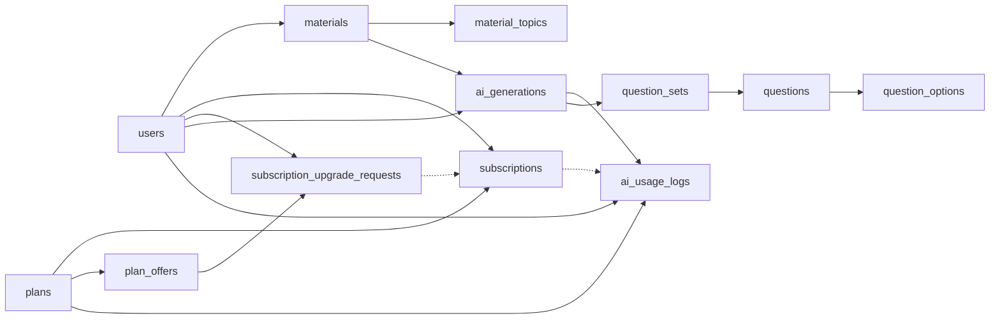
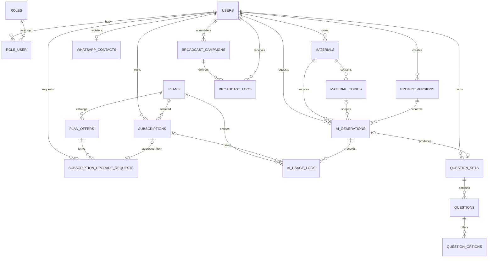

# Database Reference

## Source of Truth

Schema domain canonical tersedia dalam format DBML:

`docs/database/AI_QUESTION_BANK.dbml`

DBML tersebut dapat dibuka di dbdiagram.io atau dikompilasi menjadi SQL. Dokumen ini menjelaskan aturan bisnis yang tidak dapat dijamin hanya oleh diagram.

- Version: 0.15.0
- Domain entities: 18
- Target implementation: Laravel 13 / MySQL 8+
- Primary key style: Laravel `id` untuk entitas Phase 1; `plan_id`, `subscription_id`, `offer_id`, `upgrade_request_id`, `material_id`, `topic_id`, `generation_id`, `usage_id`, `question_set_id`, `question_id`, dan `option_id` mengikuti custom PK
- Timestamp style: `created_at`, `updated_at`, dan `deleted_at` jika diperlukan

Tabel bawaan Laravel seperti sessions, cache, jobs, job batches, dan failed jobs tidak dihitung sebagai domain entity.

## Core Pipeline

`ai_usage_logs` always belongs to a user and a Plan. Subscription is optional: Free usage is User + Free Plan with `subscription_id` null; Pro usage is User + Pro Plan + the effective Pro window captured at reservation time. `prompt_versions` remains planned and is **not** implemented. Prompt identity in 4.3+4.4 is `ai_generation_attempts.prompt_version` (config/builder string).

## Entity Catalog

### User Management

#### `users`

Menyimpan identitas Google, profil, consent, status, dan aktivitas login.

Key constraints:

- `google_id` dan `email` wajib serta unique.
- Tidak ada password lokal.
- Status: active, suspended, inactive.
- Migration OAuth Phase 1 hanya berjalan otomatis ketika tabel legacy users dan password reset masih kosong.
- Rollback migration OAuth ditolak ketika user OAuth sudah ada agar identitas login tidak terhapus.

#### `roles`

Daftar role aplikasi. Seed Phase 1: `USER` dan `ADMIN`. `role_name` wajib unique.

#### `role_user`

Pivot many-to-many user-role dengan composite primary key `(user_id, role_id)`.

### Subscription

#### `plans`

Catalog entitlement Free dan Pro. Plan bukan harga komersial.

Kolom:

- `code` unique (`free`, `pro`)
- `name` tampilan (`Free`, `Pro`)
- `storage_limit_bytes` (Free `52428800`, Pro `524288000`)
- `generation_limit` (Free `2`, Pro `100`)
- `generation_reset_strategy` (`lifetime` atau `monthly`)
- `status` (`active` atau `inactive`)

Tidak ada `price`, `currency`, `billing_period`, atau `storage_limit_mb` pada `plans`. Durasi dan harga komersial (1 bulan / 3 bulan) ada di `plan_offers`. Institution Plan tidak di-seed.

Free adalah fallback entitlement. User tanpa Pro window yang efektif memakai batas Free. Free **tidak** disimpan sebagai baris subscription.

#### `subscriptions`

Riwayat window entitlement Pro yang berbatas waktu. Bukan payment record.

Kolom:

- `starts_at` dan `ends_at` wajib (timestamp; window efektif `[starts_at, ends_at)`)
- `status`: `active`, `expired`, `cancelled`
- `cancelled_at` nullable

Aturan aplikasi:

- Hanya window Pro. Tidak ada baris subscription Free.
- Satu user boleh punya banyak baris historis.
- Paling banyak satu window efektif pada satu instant. Unique `(user_id, status)` **tidak** dipakai agar renewal berurutan dapat menyimpan dua baris `active` yang tidak overlap.
- Pencegahan overlap window efektif adalah application-layer (`ResolveUserEntitlement` fail-closed), bukan unique constraint database.
- FK `user_id` dan `plan_id` memakai `ON DELETE RESTRICT`.
- Tidak ada hard-delete lifecycle normal. Plan yang sudah direferensikan dinonaktifkan, bukan dihapus.
- Resolver entitlement: load semua row `status=active`; validasi seluruh antrian current/future (`ends_at > now` OR `starts_at >= now`) sebagai Plan Pro dengan `starts_at < ends_at`; window efektif `[starts_at, ends_at)`; 0 → Free; 1 → Pro; 2+ → error integritas. Data stale historis tidak mengunci akun. Plan Pro inactive tetap dihormati untuk window yang sudah dibayar.
- Approval menulis tepat satu baris Subscription `status=active` memakai durasi snapshot. Satu pembelian (1 atau 3 bulan) = satu baris. Tidak ada status Subscription `scheduled` atau `pending`. Tanpa antrian Pro current/future yang valid: `starts_at` = waktu approval. Jika antrian ada: `starts_at` = `max(ends_at)` antrian itu; `ends_at` = `starts_at` plus `duration_months` dengan no-overflow. Window masa depan tetap `active`.
- Jika Pro berakhir dan counted storage melebihi limit Free: data dan akses Material existing tetap; archive dan restore tetap; upload FILE baru ditolak. User di atas kuota tidak dapat membuat Material baru.

#### `plan_offers`

Offer komersial untuk satu Plan Pro.

- Seed kanonik: `pro_1m` (1 bulan, Rp10.000) dan `pro_3m` (3 bulan, Rp25.000), currency `IDR`, integer Rupiah.
- Unique `code` (`plan_offers_code_unique`). Index `(plan_id, status, sort_order)` (`plan_offers_plan_status_sort_idx`). FK `plan_id` (`plan_offers_plan_id_fk`) `ON DELETE RESTRICT`.
- `PlanOfferSeeder` memakai `firstOrCreate` on `code` dan tidak menimpa harga/status yang sudah diubah.
- Tidak ada offer Free. Status `inactive` menyembunyikan offer dari pembelian baru.

#### `subscription_upgrade_requests`

Audit permintaan pembayaran manual. Bukan status Subscription.

- Snapshot: `offer_code`, `offer_name`, `duration_months`, `price_amount`, `currency`, plus `plan_id` / `offer_id`.
- Status: `pending`, `approved`, `rejected`, `cancelled`.
- Unique `reference_code` (`upgrade_req_reference_unique`). Unique nullable `approved_subscription_id` (`upgrade_req_approved_sub_unique`).
- Index `(user_id, status)` **tidak unique**. Satu pending per user ditegakkan dengan kunci baris `users`.
- FK `restrictOnDelete`. Nama constraint pendek (`upgrade_req_*`) agar <= 64 karakter MySQL.
- Approval memakai snapshot; Plan/Offer inactive kemudian tidak membatalkan pending yang sudah ada.

### Material Management

#### `materials`

Materi milik user. Pembuatan baru hanya melalui unggah file. Baris `source_type=text` lama tetap valid.

Aturan aplikasi:

- Source upload Phase 2 hanya menerima PDF, DOCX, dan TXT. Setiap file maksimal 10 MB (batas keselamatan MVP yang tetap berlaku).
- Source upload mewajibkan internal file path, file size, MIME type, SHA-256 file hash, dan extraction status.
- Source text mewajibkan content pada baris lama. Pembuatan teks baru melalui HTTP tidak tersedia. Penggantian file unggahan tidak didukung.
- `materials.content` menggunakan LONGTEXT agar hasil extraction tidak dibatasi kapasitas MySQL TEXT.
- Source text memakai extraction status `not_required` dan dapat langsung berubah dari draft menjadi ready.
- Source upload berjalan pending, processing, completed/failed; status material menjadi ready setelah extraction completed.
- Seluruh upload yang belum dihapus dihitung sebagai storage usage, termasuk material archived dan extraction failed.
- Kombinasi `(user_id, file_hash)` unique untuk menolak upload duplikat milik user yang sama.
- Lifecycle owner: `draft|ready -> archived` dan `archived -> ready`.
- Material Management Phase 2 berdiri sendiri dari dashboard dan tidak memiliki dependency pada question set.
- Nilai quota storage akun didefinisikan pada catalog `plans` (`storage_limit_bytes`). Enforcement: counted upload usage + ukuran file baru harus `<=` limit Plan efektif (byte persis; sama dengan limit diizinkan). Batas 10 MB per file tetap terpisah. Upload file yang ditolak tidak membuat Material, file permanen, atau job ekstraksi. Archive/restore dan materi teks lama tidak memakai quota upload. Jika Pro berakhir dan counted storage melebihi limit Free: data tetap; akses Material existing tetap; archive dan restore tetap; upload FILE baru ditolak. User di atas kuota tidak dapat membuat Material baru karena unggah adalah satu-satunya jalur create. Definisi quota generation (limit + jendela) adalah Phase 3.5. Runtime reservation/charge/release `ai_usage_logs` adalah Phase 4.1+4.2.

#### `material_topics`

Bab, sub-bab, topik, focus area, urutan, dan rentang halaman yang berasal dari satu material. Input chapter dan sub-chapter yang kosong dinormalisasi menjadi empty string non-null.

`sort_order` adalah unsigned integer dengan default `0` untuk mempertahankan urutan topik pada pemrosesan AI/konten berikutnya. Kombinasi material, chapter, sub-chapter, dan topic tetap unique; urutan tidak menjadi bagian constraint unique.

Kombinasi material, chapter, sub-chapter, dan topic dibuat unique. Index `(material_id, sort_order)` dipakai untuk membaca topik sesuai urutan.

### AI Engine

#### `prompt_versions`

Snapshot aturan prompt dan output schema. Version number wajib unique dan hanya satu version boleh active. **Tidak diimplementasikan.** Phase 4.3+4.4 memakai string `generation.prompt_version` pada `McqPromptBuilder` dan menyimpannya per HTTP call di `ai_generation_attempts.prompt_version`.

Satu active prompt version berisi schema diskriminatif untuk ketiga question type.

Komponen:

- base prompt
- material rule
- assessment rule
- difficulty rule
- question rule
- answer rule
- explanation rule
- quality rule
- JSON output schema

#### `ai_generations`

Audit satu Generation request. Phase 4.1+4.2 created the table; Phase 4.3+4.4 added provider columns:

- actor (`user_id`) dan source material (`material_id`)
- assessment, difficulty, question type, dan `question_count` (integer 1..configurable max, default 10; runtime 4.3 is MCQ only)
- `output_language` (`id`/`en`, **nullable** for pre-4.3 rows; new Start requires a value; Job fail-closed if null/unsupported)
- `generation_status`: queued, processing, completed, failed, cancelled
- `execution_token` (nullable UUID; set on claim; DB-authoritative execution ownership)
- `error_message`, `error_code` (sanitized), `attempt_number` (default **0**; 1/2/3 = provider HTTP started)
- `result_json` (validated MCQ array; partial after each attempt; completed must equal `question_count`)
- `provider_name`, `model_name`, `input_tokens`, `output_tokens` (aggregates)
- nullable `parent_generation_id` (manual retry lineage; written in the Start transaction)
- `queued_at`, `started_at`, `completed_at` (success only), `failed_at` (terminal failure)

Ownership/history FKs use `restrict` delete. No `topic_id`, `prompt_version_id`, `prompt_version`, `raw_response`, or `parsed_output`. Do not persist raw prompt or full raw Gemini response.

Gemini dispatch, prompt builder, and output persistence are implemented in Phase 4.3+4.4. Owner Blade UI (create/show/history/status/retry) is Phase 4.5: `result_json` is rendered only when `generation_status=completed`. Automatic retry: same Generation, same Usage reservation, no extra credit. Competing Jobs with a different `execution_token` must not call the provider. Manual retry after terminal `failed`: old Generation stays `failed`, reservation `released`, new Generation + new reservation, `parent_generation_id` in the Start transaction. Cross-user Generation IDs 404 (owner-scoped lookup; no Admin bypass).

#### `ai_generation_attempts`

Per provider HTTP call. UNIQUE `(generation_id, attempt_number)`. Columns: provider, model, purpose (`initial|repair`), **`prompt_version` actually used**, requested/accepted counts, status (`started|succeeded|failed`), optional token/latency/finish/safe_error, `started_at`/`finished_at`. No raw payload. Inserted in a short transaction **before** HTTP while the Job still owns `processing` + `execution_token`.

#### `ai_usage_logs`

Stateful one-row-per-Generation credit ledger. **Implemented in Phase 4.1+4.2.** `generation_id` is UNIQUE. One Generation request = one credit. Counting is by row/state (`reserved` occupies one capacity; `charged` permanently consumes one; `released` occupies/consumes zero). There is no `credit_used`, `usage_action`/`action_type`, or `reservation_expires_at`.

Each row references a Plan. Subscription is nullable:

- Free: `plan_id` = catalog Free, `subscription_id` null, `window_start`/`window_end` null. Charged and reserved Free rows count toward lifetime capacity. Historical Free usage is not reset by Free → Pro → Free.
- Pro: `plan_id` = catalog Pro, `subscription_id` and exact `window_start`/`window_end` captured at Start from `ResolveGenerationQuota`. Current admission scopes to user + subscription + exact window + status. Live `Plan.generation_limit` is allowance. A queued future Subscription does not add current allowance.

Lifecycle:

1. `StartQuestionGeneration` inserts `ai_generations` (`queued`) and exactly one `ai_usage_logs` (`reserved`) in the same transaction.
2. `ConsumeGenerationCredit`: `reserved` → `charged` (idempotent if already charged).
3. `ReleaseGenerationCredit`: `reserved` → `released` (idempotent if already released). Opposite terminal transition is an integrity exception (no silent refund after charged).

Consume/Release finalize the **stored** reservation only. They must not re-resolve current entitlement/quota or move the row to the user's current Plan/Subscription/window. Stale queued/processing reserved orphans are recovered by `RecoverStaleGenerations` to `failed` + `released` with `error_code=stale_recovery`. Runtime TTL is `max(1800, configured generation.stale_after_seconds)`: 1800 seconds is the minimum safe floor; operators may configure a higher threshold. Candidate scan is unlocked; each ID uses User → Generation → Usage locks and re-checks timestamps (`queued_at` for queued, `updated_at` for processing). There is no `reservation_expires_at`. `FinalizeGenerationSuccess` / `FinalizeGenerationFailure` wrap Consume/Release so usage and generation status commit together. Gemini HTTP is never inside that transaction. Recovery does not call the provider or redispatch Jobs.

### Question Bank

#### `question_sets`

Phase 5 (`COMPLETE`). Container question milik user. **Tidak dibuat oleh job generasi Phase 4.** Persistensi hanya melalui import eksplisit generation completed MCQ. Satu `generation_id` paling banyak satu Question Set (`UNIQUE`, nullable untuk set manual di masa depan). Import menulis `status=draft`, `visibility=private`, `review_status=not_submitted`. Owner boleh mengedit draf MCQ (judul, teks, opsi A–D, jawaban benar via `is_correct`, penjelasan) dengan simpan atomik. Publish memvalidasi snapshot tersimpan lalu `draft → published` tanpa mengubah visibility atau review_status. Published read-only. Edit/publish tidak memanggil Gemini dan tidak menagih kuota generation. `result_json` generasi tidak diubah. Tidak ada migrasi Batch 2. Enum schema tetap memuat `generating` / `review` / `archived` tanpa transisi aktif ke nilai itu. True/false, essay, create manual, add/delete/reorder, unpublish, archive, visibilitas publik, dan admin review bukan Phase 5.

Admin review menggunakan `review_status` (default `not_submitted`). Tidak dijalankan di Phase 5.

#### `questions`

Menyimpan question text, type, difficulty, answer, explanation, rubric, dan points.

Question type (schema):

- `multiple_choice`
- `true_false`
- `essay`

Schema dapat menyimpan ketiga tipe. Question Bank Phase 5 hanya mengimpor, mengedit, dan menerbitkan **multiple choice**. True/false dan essay di Question Bank ditunda ke fase yang di-scope secara eksplisit.

Nomor question wajib unique dalam satu question set.

#### `question_options`

Options untuk multiple choice dan true/false.

- Multiple choice minimal empat options dan tepat satu benar.
- True/false memiliki dua options dan tepat satu benar.
- Essay tidak memiliki options serta memakai `correct_answer` dan `rubric`.

Validasi jumlah dan jawaban benar dilakukan pada domain service dalam transaction.

Saat persist essay, `parsed_output.questions[].model_answer` dipetakan ke `questions.correct_answer`.

### WhatsApp CRM

#### `whatsapp_contacts`

Satu contact WhatsApp per user, disimpan dalam format E.164. Contact menyimpan verification, consent, opt-out, dan provider ID.

`whatsapp_contacts.phone_number` menjadi sumber utama pengiriman WhatsApp. `users.phone_number` hanya profil umum.

Phase 1 mengimplementasikan identitas contact, country code, status verifikasi, consent, dan last message timestamp untuk profile setup. Provider ID dan opt-out workflow tetap Phase 7.

#### `broadcast_campaigns`

Campaign milik admin dengan message template, JSON target segment, schedule, aggregate result, dan status.

#### `broadcast_logs`

Snapshot pesan dan delivery status per campaign-user. Unique `(campaign_id, user_id)` mencegah pengiriman ganda.

## Relationship Summary

## Index and Constraint Rules

- Semua foreign key memiliki index.
- Natural identifier seperti email, google_id, role_name, version_number, plan `code`, dan phone number harus unique.
- Composite unique digunakan untuk nomor question, topic material, option label, option order, dan broadcast recipient.
- Delete cascade hanya dipakai pada child yang tidak memiliki makna tanpa parent, seperti options dan material topics.
- Data audit, subscription, generation, dan usage tidak dihapus secara cascade.
- Status dan type menggunakan enum database atau PHP backed enum yang memiliki mapping identik.

## Migration Order

Phase 1:

1. Prepare users for Google OAuth
2. roles
3. role_user
4. whatsapp_contacts

Phase 2:

1. materials, setelah users Phase 1
2. material_topics, setelah materials

Phase 3 (setelah materials):

1. plans
2. subscriptions, setelah users dan plans
3. plan_offers, setelah plans
4. subscription_upgrade_requests, setelah users, plans, plan_offers, dan subscriptions

Phase 3 tidak menjadi dependency migration untuk materials.

Phase 4.1+4.2 (setelah materials, plans, dan subscriptions):

1. ai_generations
2. ai_usage_logs

Phase 4.3+4.4:

1. alter `ai_generations` (language, execution_token, result_json, aggregates, failed_at; attempt_number default 0)
2. ai_generation_attempts

Phase 4.5+4.6: no schema migration.

Phase 5.1 (setelah `ai_generation_attempts`):

1. question_sets
2. questions
3. question_options

`prompt_versions` remains planned and is not a PHP migration.

Urutan target schema lengkap:

1. users
2. roles
3. role_user
4. plans
5. subscriptions
6. plan_offers
7. subscription_upgrade_requests
8. materials
9. material_topics
10. prompt_versions (planned; not migrated)
11. ai_generations
12. ai_usage_logs
13. ai_generation_attempts
14. question_sets
15. questions
16. question_options
17. whatsapp_contacts
18. broadcast_campaigns
19. broadcast_logs

Self-reference `ai_generations.parent_generation_id` dapat ditambahkan setelah tabel dibuat jika database membutuhkan langkah terpisah.

## Seed Data

Minimum seed:

- Phase 1 roles: USER, ADMIN.
- Phase 3 plans: canonical Free dan Pro via `PlanSeeder` (idempotent `updateOrCreate` on `code`). Tidak membuat baris subscription.
- Phase 3 offers: `pro_1m` / `pro_3m` via `PlanOfferSeeder` (`firstOrCreate` on `code`; tidak menimpa harga/status existing).
- Prompt identity: config `generation.prompt_version` / `McqPromptBuilder::version()`, audited per attempt (not seeded as `prompt_versions` rows).

Institution Plan tidak diaktifkan sebelum organization dan membership model dirancang.

## Implementation Notes

- Model Eloquent dengan custom primary key pada entitas future wajib mendefinisikan `$primaryKey`.
- Default migration `users` Laravel harus diselaraskan sebelum migration domain dibuat.
- Database constraints tidak menggantikan Form Request, Livewire validation, policy, dan domain invariant.
- Perubahan schema wajib memperbarui DBML, dokumen ini, migration, model, test, dan changelog.
- Pengembangan lokal memakai MySQL 8+ melalui Laragon dengan `DB_CONNECTION=mysql`. Jangan memakai SQLite sebagai database aplikasi lokal.
- Test otomatis tetap memakai SQLite in-memory melalui `phpunit.xml` dan tidak mengubah `DB_CONNECTION` di `.env`.