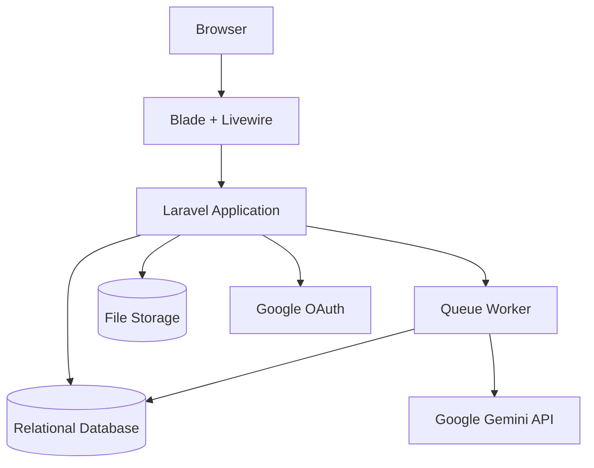
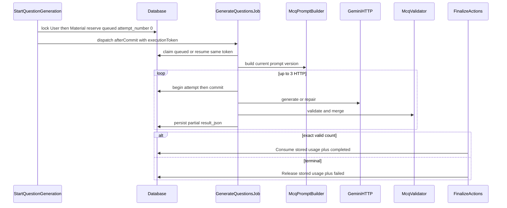

# System Design

## Design Status

- Version: 0.14
- Architecture style: Laravel modular monolith
- Runtime: PHP 8.3+, Laravel 13
- UI: Blade + Livewire + Tailwind CSS
- Authentication: Google OAuth only
- AI provider: Google Gemini
- Database source of truth: `docs/database/AI_QUESTION_BANK.dbml`

## Architecture Overview



Generation AI dipisahkan dari request web agar timeout provider tidak memblokir Livewire. UI membaca status generation dari database sampai proses selesai atau gagal.

## Architecture Decisions

### Laravel Modular Monolith

MVP dibangun sebagai satu aplikasi Laravel agar deployment, authorization, transaksi database, dan pengembangan UI tetap sederhana. Pemisahan dilakukan berdasarkan modul dan service, bukan microservice.

### Blade + Livewire

Blade menangani layout dan server-rendered page. Livewire menangani form interaktif, status queue, filter dashboard, review soal, dan admin tools. REST API publik tidak menjadi kebutuhan MVP.

Phase 2 Material Management secara khusus menggunakan Blade, controller, Form Request, policy, action/service, dan JavaScript polling minimal. Phase 2 tidak menginstal atau membuat Livewire component; Livewire hanya dapat diperkenalkan pada phase lain melalui keputusan terpisah.

### Google OAuth Only

Laravel Socialite menangani redirect dan callback Google. Tidak ada registration, password login, atau password reset lokal. Admin adalah user Google dengan role `ADMIN`, bukan guard terpisah.

### Google Gemini

Gemini menjadi provider tunggal MVP dan diakses melalui kontrak internal agar provider dapat diganti tanpa mengubah domain service.

## Application Layers

```text
Route / Livewire Component
        |
Form Validation + Authorization Policy
        |
Action / Domain Service
        |
Eloquent Model + Database Transaction
        |
Job / External Provider Adapter (jika asynchronous)
```

- Livewire component mengelola state UI, bukan aturan bisnis.
- Action atau service mengelola use case dan transaction boundary.
- Model mengelola relasi serta query scope sederhana.
- Job mengelola AI generation, ekstraksi materi, dan broadcast Phase 7.
- Provider adapter mengisolasi Google Gemini dan layanan eksternal.

## Suggested Directory Structure

```text
app/
|-- Actions/
|   |-- Auth/
|   |-- Materials/
|   |-- QuestionSets/
|   `-- Subscriptions/
|-- Contracts/AI/
|-- Data/
|-- Jobs/
|-- Livewire/
|   |-- User/
|   `-- Admin/
|-- Models/
|-- Policies/
|-- Services/
|   |-- AI/
|   |-- Materials/
|   `-- Subscriptions/
`-- Support/
```

Repository layer hanya ditambahkan jika query kompleks atau sumber data perlu diabstraksi. Eloquent tidak perlu dibungkus repository secara otomatis.

## Core Modules

### Authentication and User Management

- Google OAuth redirect dan callback.
- Auto-provision user dan sinkronisasi profil.
- Role `USER` dan `ADMIN`.
- First-login phone setup melalui `whatsapp_contacts`.
- User status enforcement.
- Session termination dan logout.

### Material Management

- Menu material berdiri sendiri dan dapat dibuka langsung dari dashboard tanpa membuat question set.
- Upload hanya mendukung PDF, DOCX, dan TXT. Setiap file maksimal 10 MB (batas keselamatan MVP). Quota storage akun Plan (Free 50 MiB / Pro 500 MiB total) ditegakkan pada upload dan tidak menggantikan batas per file.
- Input teks manual langsung menghasilkan material ready.
- Metadata file, hash, extraction status, dan storage usage.
- Chapter, sub-chapter, topic, dan focus area.
- Ownership policy.
- Material text memakai extraction status `not_required`; upload berjalan dari pending ke processing lalu completed/failed.
- Material berubah dari draft menjadi ready setelah teks tersedia atau extraction selesai.
- Upload wajib menyimpan internal file path, file size, MIME type, SHA-256 hash, dan extraction status.
- Kombinasi user dan file hash unique untuk mencegah duplikasi per user.
- Storage usage menghitung seluruh upload yang belum dihapus, termasuk archived dan extraction failed.
- Lifecycle material mendukung `draft|ready -> archived` dan owner restore `archived -> ready`.

### Subscription and Quota

- Catalog Plan: Free dan Pro sebagai entitlement (bukan harga). Institution adalah arah post-MVP.
- Free adalah fallback jika tidak ada window Pro efektif. Tidak ada baris subscription Free.
- Subscription adalah riwayat window Pro `[starts_at, ends_at)` dengan status `active|expired|cancelled`.
- Paling banyak satu window efektif per instant. Resolver memvalidasi seluruh antrian `active` current/future sebagai Pro; overlap efektif fail-closed; data stale historis tidak mengunci akun. Plan Pro inactive tidak mencabut window yang sudah dibayar.
- Limit dibaca live dari Plan (bukan snapshot di Subscription). Quota storage akun ditegakkan di `GuardUploadStorageQuota` dengan kunci baris `users` per pemilik. Duplikat `(user_id, file_hash)` dicek ulang di bawah kunci sebelum quota. Definisi quota generation: `ResolveGenerationQuota` (limit + jendela bulanan dari anchor `starts_at`). Runtime reservation/charge/release: `StartQuestionGeneration`, `ConsumeGenerationCredit`, `ReleaseGenerationCredit`, dan `ai_usage_logs`. Gemini MCQ + `GenerateQuestionsJob` are Phase 4.3+4.4. Owner Blade generation UI, quota Terpakai/Diproses/Tersedia, and manual retry are Phase 4.5. Stale recovery is Phase 4.6.
- Jika Pro berakhir dan counted storage melebihi limit Free: data tetap; akses Material existing tetap; create teks, archive, dan restore tetap; upload FILE baru ditolak.
- UI `/account/subscription` (Blade), QRIS statis pada disk `public` (`storage/app/public/payment/qris.png`), konfirmasi WhatsApp, dan verifikasi admin minimum `/admin/subscription-upgrades` sudah ada. Tidak ada payment gateway di MVP. Purchase menulis `subscription_upgrade_requests`. Approval menulis tepat satu baris `subscriptions` `status=active`: tanpa antrian Pro current/future, `starts_at` = waktu approval; jika antrian ada, `starts_at` = `max(ends_at)` antrian itu. `ends_at` memakai durasi bulan kalender no-overflow. Satu pembelian 3 bulan = satu baris Subscription. Window masa depan tetap `active`; tidak ada status Subscription `scheduled`/`pending`.
- Verifikasi pembayaran Admin tidak menembus `MaterialPolicy`. Admin tidak memperoleh akses global ke Material privat. Halaman admin user-detail penuh bukan bagian Phase 3.

### AI Engine

Phase 4.3+4.4 implemented Gemini structured MCQ generation and async orchestration on the 4.1+4.2 reservation foundation. Phase 4.5 adds owner-only Blade generation create/show/history/status/retry. Phase 4.6 recovers stale queued/processing reservations. True/false and essay are not provider-executed in this phase.



AI Engine consists of:

- Prompt identity: `McqPromptBuilder::version()` from config, persisted on each `ai_generation_attempts.prompt_version`. No `prompt_versions` table. No `ai_generations.prompt_version`.
- Gemini HTTP client adapter (`generateContent`, JSON schema, 60s timeout). Primary/fallback models configurable.
- Queue-based generation on connection `database-generation` / queue `question-generation`. Existing Material extraction connection `retry_after` 90 is unchanged.
- MCQ schema validation and deterministic duplicate detection. Targeted repair requests only missing/invalid slots.
- Automatic retry on the same Generation and reservation; `execution_token` is DB-authoritative. Manual retry after `failed` creates a new Generation with `parent_generation_id` written in the Start transaction.
- Provider/model/token metadata on attempts and optional Generation aggregates. Do not persist raw prompt or full raw Gemini response. Diagnostic/error metadata is sanitized.
- Phase 4 does not create `question_sets`. Completed `result_json` is a read-only preview. Phase 5.1–5.6 import an owned completed MCQ Generation into a draft Question Set, allow draft MCQ edit, and publish without modifying Generation runtime data.
- Stale queued (`queued_at`) or processing (`updated_at`) reserved generations are terminalized to `failed` + `released` with `stale_recovery` by `generations:recover-stale` (every minute, without overlapping). No provider HTTP and no Job redispatch.

### Question Bank

- Phase 5.1–5.6 implemented (pending review): owner Blade index/show/edit; explicit import from completed MCQ Generation; atomic draft MCQ save; publish `draft → published` after persisted integrity checks; `UNIQUE(generation_id)`; snapshot rows in `question_sets` / `questions` / `question_options`.
- Import writes `status=draft`, `visibility=private`, `review_status=not_submitted`. Publish changes only `status` to `published`. Locked lifecycle is `draft → published`. Manual create, unpublish, archive, and TF/essay are later.
- Schema preserves canonical enum values (`generating`, `review`, `archived`) but Batch 2 does not transition into them.
- Optional admin review and public visibility remain later (Phase 6).

### Admin Dashboard

- User management CRUD.
- Question bank management CRUD dan review.
- AI generation monitoring.
- AI usage monitoring.
- Subscription monitoring.
- Manual upgrade/payment verification (approve / reject / cancel). Verifikasi ini tidak menembus `MaterialPolicy` dan tidak memberi akses Material privat global.

### WhatsApp CRM

Modul Phase 7 post-MVP yang menambahkan broadcast compose, confirmation, queue, contact consent, segment filter, provider message ID, dan delivery status. Implementasi harus menghormati opt-out.

## Data Design

Delapan belas entitas domain dan seluruh relasinya didefinisikan pada:

- `docs/database/AI_QUESTION_BANK.dbml`
- `docs/database/DATABASE_REFERENCE.md`

Tabel infrastruktur Laravel seperti sessions, cache, jobs, job batches, dan failed jobs tetap dikelola oleh migration framework dan tidak dihitung sebagai entitas domain.

## Security Design

- Session authentication dan CSRF untuk seluruh UI.
- OAuth state validation melalui Socialite.
- Role middleware untuk route admin.
- Policy untuk material, question set, dan generation. Admin payment review tidak mengubah `MaterialPolicy` owner-only.
- MIME, extension, dan size validation pada upload.
- Rate limit untuk Google OAuth redirect/callback dan konfirmasi langganan (`throttle:10,1`). Phase 4 generation create/retry tidak menambah HTTP limiter terpisah; kapasitas ditegakkan oleh reservation kuota. Broadcast mulai Phase 7.
- Environment secret untuk Google dan Gemini.
- Sanitasi output ketika dirender pada Blade.
- Admin action dan AI request harus dapat diaudit.

## Configuration

Environment minimum:

```dotenv
GOOGLE_CLIENT_ID=
GOOGLE_CLIENT_SECRET=
GOOGLE_REDIRECT_URI=
SUBSCRIPTION_WHATSAPP_NUMBER=
SUBSCRIPTION_QRIS_PATH=payment/qris.png
GEMINI_API_KEY=
GEMINI_PRIMARY_MODEL=gemini-3.5-flash-lite
GEMINI_FALLBACK_MODEL=gemini-3.7-flash
GENERATION_QUEUE_CONNECTION=database-generation
GENERATION_QUEUE=question-generation
GENERATION_QUEUE_RETRY_AFTER=360
GENERATION_STALE_AFTER_SECONDS=1800
GENERATION_STALE_RECOVERY_BATCH=50
```

`GENERATION_STALE_AFTER_SECONDS` default and runtime floor is 1800 seconds; operators may configure a higher threshold. Runtime recovery uses `max(1800, configured)`.

Nama model Gemini disimpan pada `config/generation.php` (primary + fallback) dan dicatat per provider attempt. Production membutuhkan worker terpisah untuk `database-generation` / `question-generation` (timeout ~300) di samping worker extraction yang ada.

## Deployment Topology

MVP membutuhkan:

1. Web application Laravel.
2. Queue worker for `material-extraction,default` (existing `retry_after` 90).
3. Queue worker for `database-generation` / `question-generation` (`retry_after` 360, timeout ~300).
4. Scheduler.
5. Relational database.
6. File storage lokal atau object storage.

Production dapat menambahkan Redis untuk queue/cache, object storage, monitoring, dan multiple workers tanpa mengubah domain model.