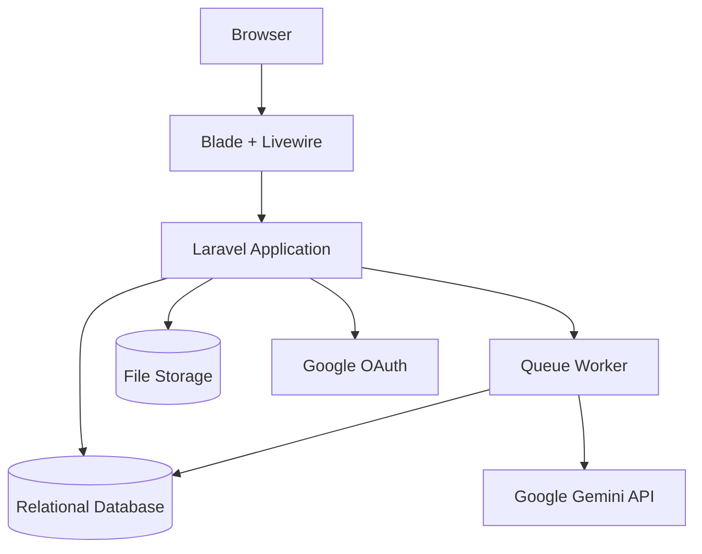
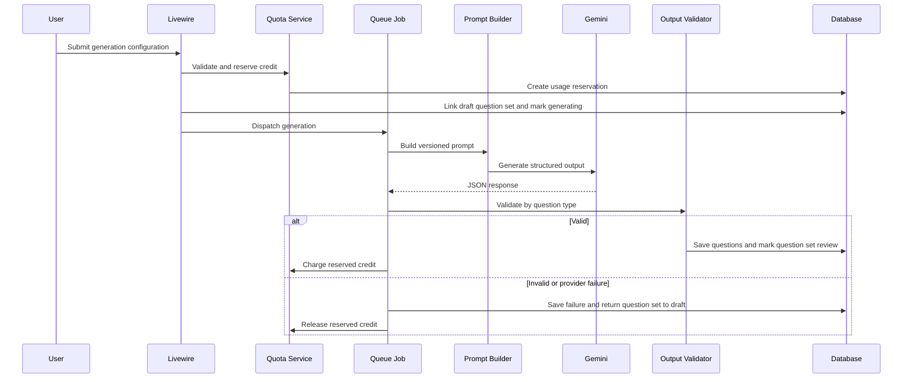

# System Design

## Design Status

- Version: 0.4
- Architecture style: Laravel modular monolith
- Runtime: PHP 8.3+, Laravel 13
- UI: Blade + Livewire + Tailwind CSS
- Authentication: Google OAuth only
- AI provider: Google Gemini
- Database source of truth: `docs/database/AI_QUESTION_BANK.dbml`

## Architecture Overview



Generation AI dipisahkan dari request web agar timeout provider tidak memblokir Livewire. UI membaca status generation dari database sampai proses selesai atau gagal.

## Architecture Decisions

### Laravel Modular Monolith

MVP dibangun sebagai satu aplikasi Laravel agar deployment, authorization, transaksi database, dan pengembangan UI tetap sederhana. Pemisahan dilakukan berdasarkan modul dan service, bukan microservice.

### Blade + Livewire

Blade menangani layout dan server-rendered page. Livewire menangani form interaktif, status queue, filter dashboard, review soal, dan admin tools. REST API publik tidak menjadi kebutuhan MVP.

### Google OAuth Only

Laravel Socialite menangani redirect dan callback Google. Tidak ada registration, password login, atau password reset lokal. Admin adalah user Google dengan role `ADMIN`, bukan guard terpisah.

### Google Gemini

Gemini menjadi provider tunggal MVP dan diakses melalui kontrak internal agar provider dapat diganti tanpa mengubah domain service.

## Application Layers

```text
Route / Livewire Component
        |
Form Validation + Authorization Policy
        |
Action / Domain Service
        |
Eloquent Model + Database Transaction
        |
Job / External Provider Adapter (jika asynchronous)
```

- Livewire component mengelola state UI, bukan aturan bisnis.
- Action atau service mengelola use case dan transaction boundary.
- Model mengelola relasi serta query scope sederhana.
- Job mengelola AI generation, ekstraksi materi, dan broadcast Phase 7.
- Provider adapter mengisolasi Google Gemini dan layanan eksternal.

## Suggested Directory Structure

```text
app/
|-- Actions/
|   |-- Auth/
|   |-- Materials/
|   |-- QuestionSets/
|   `-- Subscriptions/
|-- Contracts/AI/
|-- Data/
|-- Jobs/
|-- Livewire/
|   |-- User/
|   `-- Admin/
|-- Models/
|-- Policies/
|-- Services/
|   |-- AI/
|   |-- Materials/
|   `-- Subscriptions/
`-- Support/
```

Repository layer hanya ditambahkan jika query kompleks atau sumber data perlu diabstraksi. Eloquent tidak perlu dibungkus repository secara otomatis.

## Core Modules

### Authentication and User Management

- Google OAuth redirect dan callback.
- Auto-provision user dan sinkronisasi profil.
- Role `USER` dan `ADMIN`.
- First-login phone setup melalui `whatsapp_contacts`.
- User status enforcement.
- Session termination dan logout.

### Material Management

- Upload file dan input teks manual.
- Metadata file, hash, extraction status, dan storage usage.
- Chapter, sub-chapter, topic, dan focus area.
- Ownership policy.
- Material text memakai extraction status `not_required`; upload berjalan dari pending ke processing lalu completed/failed.
- Material berubah dari draft menjadi ready setelah teks tersedia atau extraction selesai.

### Subscription and Quota

- Free, Pro, dan future Institution plan.
- Satu subscription aktif per user.
- Generation credit per billing period.
- Storage limit berdasarkan total file aktif.
- Reserve, charge, atau release credit melalui `ai_usage_logs`.
- Reservation memiliki expiry dan dilepas scheduler jika worker tidak menyelesaikannya.
- Approval/rejection manual mengirim notifikasi email.

### AI Engine



AI Engine terdiri dari:

- Prompt version management.
- Gemini client adapter.
- Queue-based generation.
- Schema validation per question type.
- Retry lineage.
- Token, cost, raw response, dan parsed output audit.
- Retry hanya berlaku pada generation gagal; draft question set yang sama diarahkan ke generation anak dan kembali berstatus generating.

### Question Bank

- Question set manual atau hasil AI.
- Multiple choice, true/false, dan essay.
- User review dan editing.
- Draft, generating, review, publish, archive.
- Optional admin review.
- Private visibility secara default; public membutuhkan aksi eksplisit pemilik.

### Admin Dashboard

- User management CRUD.
- Question bank management CRUD dan review.
- AI generation monitoring.
- AI usage monitoring.
- Subscription approve/reject.

### WhatsApp CRM

Modul Phase 7 post-MVP yang menambahkan broadcast compose, confirmation, queue, contact consent, segment filter, provider message ID, dan delivery status. Implementasi harus menghormati opt-out.

## Data Design

Enam belas entitas domain dan seluruh relasinya didefinisikan pada:

- `docs/database/AI_QUESTION_BANK.dbml`
- `docs/database/DATABASE_REFERENCE.md`

Tabel infrastruktur Laravel seperti sessions, cache, jobs, job batches, dan failed jobs tetap dikelola oleh migration framework dan tidak dihitung sebagai entitas domain.

## Security Design

- Session authentication dan CSRF untuk seluruh UI.
- OAuth state validation melalui Socialite.
- Role middleware untuk route admin.
- Policy untuk material, question set, dan generation.
- MIME, extension, dan size validation pada upload.
- Rate limit untuk login callback, generation, serta broadcast mulai Phase 7.
- Environment secret untuk Google dan Gemini.
- Sanitasi output ketika dirender pada Blade.
- Admin action dan AI request harus dapat diaudit.

## Configuration

Environment minimum:

```dotenv
GOOGLE_CLIENT_ID=
GOOGLE_CLIENT_SECRET=
GOOGLE_REDIRECT_URI=
GEMINI_API_KEY=
GEMINI_MODEL=
```

Nama model Gemini disimpan pada konfigurasi aplikasi dan dicatat pada setiap generation.

## Deployment Topology

MVP membutuhkan:

1. Web application Laravel.
2. Queue worker.
3. Scheduler.
4. Relational database.
5. File storage lokal atau object storage.

Production dapat menambahkan Redis untuk queue/cache, object storage, monitoring, dan multiple workers tanpa mengubah domain model.